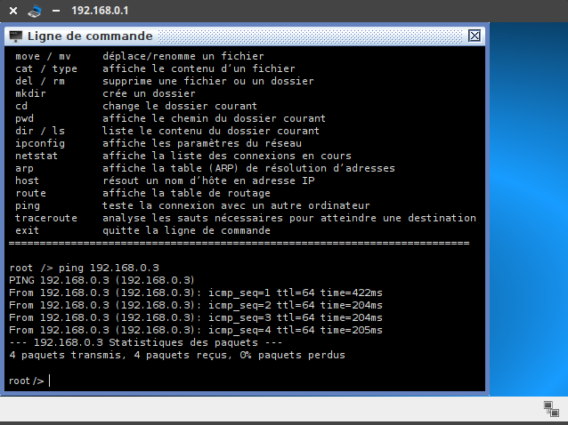

### 0. Préambule

Dans ce chapitre, il fera appel de nombreuses fois au logiciel de simulation réseau Filius.  
Vous pouvez le télécharger :
- version Windows : [ici](https://www.lernsoftware-filius.de/downloads/Setup/Filius-Setup-1.9.0.exe)
- version Linux : [ici](https://www.lernsoftware-filius.de/downloads/Setup/filius_1.9.0_all.deb)
- version Mac : il n'y en a pas, désolé.

Ce n'est pas obligatoire de l'installer pour suivre ce cours, mais cela rendra le cours plus interactif d'avoir Filius à portée de main pour voir en direct les réactions du réseau.

Filius est très intuitif dans sa manipulation. Signalons juste la présence de deux modes : 
- le mode Conception, matérialisé par l'icone  
- le mode Simulation, matérialisé par l'icone  

### 1. Un premier réseau local

Créons le réseau local ci-dessous :


Testons le ```ping``` de la machine ```192.168.0.1```  vers la machine ```192.168.0.3```.  
Il est nécessaire pour cela d'installer la «ligne de commande», en mode simulation.

**Résultat :**



Le vocabulaire pour comprendre :

- **Adresse IP** : lorsque nous avons créé le réseau, nous avons attribué à chaque ordinateur une adresse, dite **adresse IP**, composée (pour l'IPv4)
de 4 nombres entre 0 et 255, séparés par un point. Exemple : 123.0.168.255 est une adresse IP valide, 156.286.3.16 n'est pas une adresse IP valide.
Ces adresses servent à identifier un ordinateur sur un réseau. Nous verrons plus tard qu'elles permettent aussi de savoir à quel sous-réseau l'ordinateur appartient, mais c'est une autre histoire. 

<br>

- **ping** : on appelle un **ping** l'action d'envoyer sur le réseau un tout petit message, dont l'utilité est juste de vérifier si la connexion entre deux ordinateurs est opérante. En réalité, on envoie un ping, on reçoit un pong, ce qui permet de voir que la connexion est ok. Dans la fenêtre ci-dessus, 4 «paquets» ont été envoyés, et bien ré-envoyés.  
Les ordinateurs ```192.168.0.1```  vers la machine ```192.168.0.3``` sont bien connectés et peuvent s'échanger des informations.

#### 1.1. La carte réseau et son adresse MAC
Chaque ordinateur sur le réseau dispose d'une adresse MAC, qui une valeur **unique** attribuée à sa carte réseau (Ethernet, Wifi, 4G, 5G, ...) lors de sa fabrication en usine.

Cette adresse est codée sur 48 bits, présentés sous la forme de 6 octets en hexadécimal. Exemple : ```fc:aa:14:75:45:a5```

Les trois premiers octets correspondent au code du fabricant.
Un site comme https://www.macvendorlookup.com/ vous permet de retrouver le fabricant d'une adresse MAC quelconque.

#### 1.2. Switch, hub, quelle différence ?

- Au sein d'un **hub Ethernet** (de moins en moins vendus), il n'y a **aucune analyse** des données qui transitent : il s'agit simplement d'un dédoublement des fils de cuivre (tout comme une multiprise électrique). L'intégralité des messages est donc envoyée à l'intégralité des ordinateurs du réseau, même s'ils ne sont pas concernés.


- Au sein d'un **switch Ethernet** , une analyse est effectuée sur la trame qui est à distribuer (voir [ici](https://github.com/glassus/nsi/blob/master/Premiere/Theme04_Architecture_materielle/04_Protocoles_de_communication.md)). Lors d'un branchement d'un nouvel ordinateur sur le switch, celui-ci récupère son adresse MAC, ce qui lui permet de **trier** les messages et de ne les distribuer qu'au bon destinataire.


----
**Séance du 25 mai**
_Résumé des épisodes précédents : nous avons créé un réseau avec un switch. Les ordinateurs sont capables de communiquer entre eux grâce à leur adresse MAC. Nous allons maintenant créer un deuxième sous-réseau, dans le but de les relier entre eux. Nous aurons donc un grand réseau constitué de deux sous-réseaux._


### 2. Un deuxième sous-réseau

Vous pouvez trouver le fichier Filius  [ici](data/res_filius_SNT.fls).

Rajoutons un deuxième sous-réseau de la manière suivante (penser à bien renommer les switchs).


**Comment relier ces deux sous-réseaux ?**

Une réponse pas si bête : avec un cable entre les deux switchs !


1. Testons cette hypothèse en essayant de pinger la machine ```192.168.1.2``` depuis la machine ```192.168.0.1```. 
<details><summary> Résultat </summary>
<p>


Cela ne marche pas. Les paquets sont perdus.
</p>
</details>

<br>

2. Temporairement, renommons la machine ```192.168.1.2``` en ```192.168.0.33```. Testons à nouveau le ping depuis la machine ```192.168.0.1```.

<details><summary> Résultat </summary>
<p>


Cela marche. Les paquets sont bien acheminés.
</p>
</details>

<br>


**Intuition** : la notion de sous-réseau n'est pas *topologique* («il suffit de relier les ordinateurs entre eux») mais obéit à des règles numériques.

#### 2.1. Notion de masque de sous-réseau

Dans Filius, lors de l'attribution de l'adresse IP à une machine, une ligne nous permet de spécifier le **masque de sous-réseau** (appelé simplement « Masque » dans Filius). C'est ce masque qui va permettre de déterminer si une machine appartient à un sous-réseau ou non, en fonction de son adresse IP.


**Explication**
- Si le masque est ```255.255.255.0```, toutes les machines partageant les mêmes **trois** premiers nombres de leur adresse IP appartiendront au même sous-réseau. Comme ceci est le réglage par défaut de Filius, cela explique pourquoi  ```192.168.0.33``` et ```192.168.0.1``` sont sur le même sous-réseau, et pourquoi  ```192.168.1.2``` et ```192.168.0.1``` ne sont pas sur le même sous-réseau.

Dans cette configuration, 256 machines peuvent donc appartenir au même sous-réseau (ce n'est pas tout à fait le cas car des adresses finissant par 0 ou par 255 sont réservées).

- Si le masque est ```255.255.0.0```, toutes les machines partageant les mêmes **deux** premiers nombres de leur adresse IP appartiendront au même sous-réseau.  
Dans cette configuration, 65536 machines peuvent être dans le même sous-réseau. (car 256^2=65536)


**Exercice**
- Renommons ```192.168.0.33``` en ```192.168.1.2``` et modifions son masque en ```255.255.0.0```.
- Modifions aussi le masque de ```192.168.0.1``` en ```255.255.0.0```.
- Testons le ping de ```192.168.0.1``` vers ```192.168.1.2```.

<details><summary> Résultat </summary>
<p>


Cela marche. Les deux machines appartiennent maintenant au même sous-réseau !
</p>
</details>

</br>

**Conclusion**
Deux ordinateurs peuvent communiquer _directement_ (à travers des switchs) s'ils sont dans le même sous-réseau.  

Pour déterminer si deux machines sont dans le même sous-réseau ou pas, il faut observer leur masque de sous-réseau.  

Dans le prochain épisode : _comment faire si les machines ne sont pas dans le même sous-réseau ???_


---


G.Lassus, Lycée François Mauriac --  Bordeaux  


