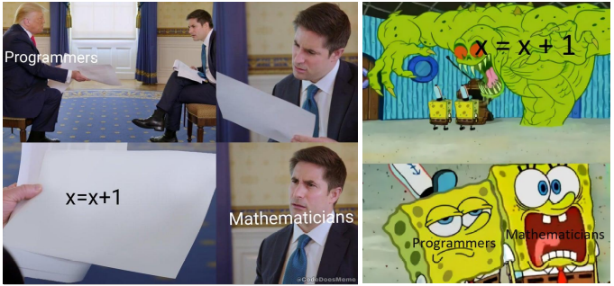

## 1. Variables et affectation

### 1.1 Stocker une valeur dans une variable
La mémoire d'un ordinateur peut-être perçue comme un ensemble de tiroirs.

Écrire  l'instruction :
```python
a = 2
```

va provoquer chez l'ordinateur (en simplifiant beaucoup) le comportement suivant :
- Est-ce que je possède **déjà** un tiroir appelé ```a``` ? 
    - si oui, je me positionne devant.
    - si non, je crée un tiroir appelé ```a```.


<p align="center">
 
&nbsp;&nbsp;&nbsp;&nbsp;
 
&nbsp;&nbsp;&nbsp;&nbsp;
 
</p>

- J'ouvre le tiroir et j'y dépose la valeur numérique 2. Si le tiroir contenait déjà une valeur, celle-ci disparaît. On dit souvent qu'elle est **écrasée**.

> Le sens du signe = n'est donc **pas du tout le même** qu'en mathématiques. On dit que c'est un signe d'**affectation**. 
L'écriture a = 2 signifie donc a ← 2.

⚠ Attention : ici, nous avons stocké un nombre (le nombre 2) dans la variable ```a```. Mais une variable peut contenir une phrase, une liste de nombres, une image...beaucoup d'objets de **type** différent.

### 1.2  Récupérer la valeur stockée dans une variable

#### 1.2.1 Dans un script
Dans un script Python, pour afficher le contenu d'une variable, on utilisera la fonction ```print()```.

```python
a = 2
maison = "Serdaigle"
print(a)
print(maison)
```

renverra la sortie suivante :

```python
2
'Serdaigle'
```

#### 1.2.2 En console

Dans la console interactive de Python, c'est encore plus simple, il suffit d'écrire le nom de la variable et d'appuyer sur Entrée.

```python
>>> a
2
>>> maison
'Serdaigle'
>>> b
Traceback (most recent call last):
  File "<pyshell>", line 1, in <module>
NameError: name 'b' is not defined
```

Bien sûr, il faut que la variable ait été créée au préalable... sinon Python renvoie un message d'erreur.


### 1.3 Modifier le contenu d'une variable

#### 1.3.1 Écraser une ancienne valeur
Comme déjà évoqué, affecter une nouvelle valeur dans une variable déjà existante écrasera l'ancienne valeur. C'est très pratique, mais parfois dangereux.

```python
>>> a = "mon mot de passe ultrasecret"
>>> a
"mon mot de passe ultrasecret"
>>> a = 3
>>> a
3
```
#### 1.3.2 Utiliser des variables pour calculer de nouvelles variables

```python
AB = 3
AC = 4
BC = (AB**2 + AC**2)**0.5
print("l'hypoténuse mesure", BC, "centimètres")
```

*Remarque : en Python, la puissance s'obtient par ```**```. La racine carrée est une puissance ```0.5```.*

#### 1.3.3 Modifier une variable à partir d'elle-même

L'instruction
```python
a = a + 1
```
écrit une égalité mathématique fort peu intéressante (toujours fausse, car elle est équivalente à l'égalité 0 = 1), 
mais est une écriture informatique très utile : la variable ```a``` se modifie à partir d'elle-même.

<p align="center">
 
</p>


```python
a = 10
a = a + 1
print(a)
```

renverra 
```python
11
```

La compréhension de cette écriture est essentielle, ainsi que de comprendre la différence entre le point de vue mathématique et informatique d'une même écriture.



#### 1.3.4 Inverser deux variables

Imaginons les variables suivantes :

```python
maisonHarry = "Serpentard"
maisonMalfoy =  "Gryffondor"
```

Il semblerait qu'une erreur se soit glissée dans ces déclarations de variables... Mais comment faire pour inverser les valeurs ?

▸ **Méthode naïve**

```python
maisonHarry = maisonMalfoy
maisonMalfoy = maisonHarry
```
à l'arrivée, on se retrouve avec 
```python
>>> maisonHarry
'Gryffondor'
>>> maisonMalfoy
'Gryffondor'
```

En effet, la variable ```maisonHarry```  a été écrasée...  et on ne peut plus retrouver sa valeur pour la donner à ```maisonMalfoy```.

▸ **La solution universelle**

Nous allons passer par une variable temporaire qui nous permettra de stocker la valeur écrasée.

```python
maisonHarry = "Serpentard"
maisonMalfoy =  "Gryffondor"

# on procède à l'échange

t = maisonHarry
maisonHarry = maisonMalfoy
maisonMalfoy = t
```

Ainsi, 
```python
>>> maisonHarry
'Gryffondor'
>>> maisonMalfoy
'Serpentard'
```


▸ **La solution «pythonesque»**

Chaque langage de programmation ayant ses particularités, Python propose une syntaxe particulièrement agréable pour pouvoir faire l'échange de deux variables sans faire intervenir une variable temporaire :

```python
a = 2
b = 5

# on procède à l'échange
a,b = b,a
```
Ainsi,
```python
>>> a
5
>>> b
2
```

Les variables ont bien été échangées. 

*Remarque : Python ne fait que nous faciliter le travail. Il a dû lui-même créer une variable temporaire pour stocker la variable ```a``` avant de l'écraser : la simultanéité n'existe pas en informatique !*

### 1.4 Jouer avec les variables
L'objet de l'activité est de prendre un code pré-existant, produisant une animation graphique, et de le modifier petit à petit pour comprendre le rôle de chaque élément. 


[Lien vers le code et l'animation en ligne](https://trinket.io/library/trinkets/bd1c5be675)

#### 1.4.1 Quelques indications sur le code d'origine 

 - ```background(r,g,b)``` : l'arrière-plan sera de la couleur ```(r,g,b)```, où ```r```, ```g``` et ```b``` sont des nombres compris entre 0 et 255, déterminant les composantes rouge, verte et bleue de la couleur totale. Voir  [ici](https://www.w3schools.com/colors/colors_rgb.asp) .
- ```size(x,y)``` : l'espace de dessin mesurera ```x``` pixels de large sur ```y``` pixels de haut.

- ```frameRate(n)``` : l'animation sera rafraîchie ```n``` fois par seconde.

- ```stroke(r,g,b)``` : la couleur des futurs tracés (lignes, cercles...) sera la couleur ```(r,g,b)```

- ```randint(a,b)``` : renvoie un nombre pseudo-aléatoire entre ```a``` et ```b```.

- ```line(xA,yA,xB,yB)``` : trace une ligne entre les points ```(xA,yA)``` et ```(xB,yB)```.

#### 1.4.2 Manipulations à effectuer
1. Faire en sorte qu'il suffisse de modifier les valeurs de ```largeur``` et ```hauteur``` pour que le dessin s'adapte à la nouvelle taille.
2. Faire en sorte que les lignes tracées soient de couleur aléatoire.

#### 1.4.3 Pour aller plus loin

- ```strokeWeight(n)``` : le tracé suivant aura une épaisseur de ```n```  pixels.
- ```fill(r,b,g)``` : la figure géométrique suivante sera remplie de la couleur ```(r,g,b)```.
- ```circle(x, y, r)``` : trace un cercle de centre ```(x,y``` et de rayon ```r```.
- ```mouseX``` et ```mouseY``` : renvoient respectivement l'abscisse et l'ordonnée de la souris.

(beaucoup) d'autres possibilités à l'adresse [https://py.processing.org/tutorials/](https://py.processing.org/tutorials/).


### 1.5 Vers les tests...
Rendez-vous à l'adresse
[https://trinket.io/library/trinkets/d9e1c58ea0](https://trinket.io/library/trinkets/d9e1c58ea0)

L'objectif est de faire bouger la balle... puis la faire rebondir !

#### 1.5.1 Mouvement de la balle
Pour l'instant la balle est statique. Du moins elle *apparaît* statique, mais elle en fait redessinnée au même endroit 25 fois par seconde !
1. Comment faire en sorte qu'à chaque tour de boucle (25 fois par seconde donc) la balle ne soit pas redessinée au même endroit, mais légèrement décalée vers la droite ? 
2. Résoudre le problème de superposition des anciennnes balles afin de donner l'illusion d'un mouvement
3. Stocker dans une variable appelée ```dx``` le décalage de l'abscisse.
 

#### 1.5.2 Rebond de la balle
Pour l'instant, notre balle s'enfuit désespérément... Comment détecter qu'elle sortie de son aire de jeu ?

## 2. Instructions conditionnelles
Un ordinateur ne fait pas que *stocker* des valeurs dans des variables et les faire évoluer.
Il effectue aussi des **tests** pour déclencher (ou pas) d'autres actions. On parle alors d'*instructions conditionnelles*.

### 2.1 Premier test élémentaire
La syntaxe d'un test en Python est la suivante :
```python
if condition :
  instruction
```
Remarquez bien :
- les deux points qui suivent la condition : ils signalent l'ouverture d'un bloc de code, celui qui sera exécuté si la condition est valide.
- le léger décalage (appelé **indentation**) de la ligne (ou les lignes) contenant l'instruction à exécuter. Cette indentation n'est pas «décorative» : elle est cruciale pour que Python comprenne quelle partie de code doit être exécutée ou pas.

**Exemple**
```python
heure = 13
if heure > 12 :
  print("j'ai faim")
```
Ce code va renvoyer ```j'ai faim``` car la condition est validée. On dit que la condition est «vraie».

#### 2.1.2 Le retour de la balle fuyante
1. Détectez que la balle est sortie en faisant apparaître le mot "sortie..." en console (le mot apparaîtra sous la zone de dessin).
2. Modifiez le code pour que la balle reparte dans l'autre sens au lieu de s'enfuir.
3. Faites rebondir la balle sur les deux murs
4. Faites en sorte que la balle n'ait plus qu'un simple mouvement latéral mais un mouvement «de travers»
5. Gérez les rebonds, rajoutez de l'aléatoire...


Voir un exemple de correction, ici : [https://trinket.io/library/trinkets/05b7d7f7c3](https://trinket.io/library/trinkets/05b7d7f7c3)... et amusez-vous à modifier ce code !