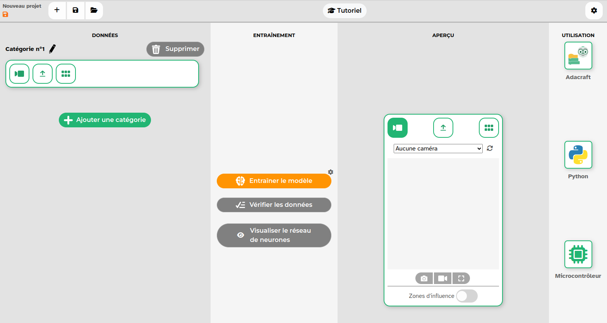

# Activité 1 : Entraînement d'un modèle de classification

Nous allons utiliser l'excellent site [https://fr.vittascience.com/ia/images.php](https://fr.vittascience.com/ia/images.php){. target="_blank"}
{: .center}

- **Étape 1 :** Créez deux catégories «Chats» et «Chiens» en vous servant des jeux de données proposés.

- **Étape 2 :** Entrainez le modèle.

- **Étape 3 :** Testez le modèle sur une nouvelle photo d'animal, par exemple [celle-ci](data/new_cat.jpeg){. target="_blank"}. Vous pouvez tester aussi avec une autre photo de votre choix (y compris quelque chose qui n'est ni un chien ni un chat).

- **Étape 4 :** Cliquez sur «Visualisez le réseau de neurones» et choisissez la vue détaillée.

Vous pouvez ensuite entrainer un autre modèle (notamment le Pierre-Feuille-Ciseaux, à entrainer depuis votre téléphone pour pouvoir utiliser la caméra !)
