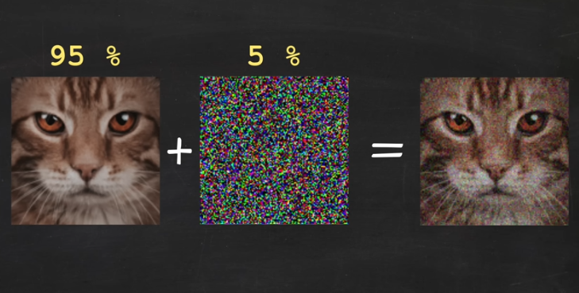
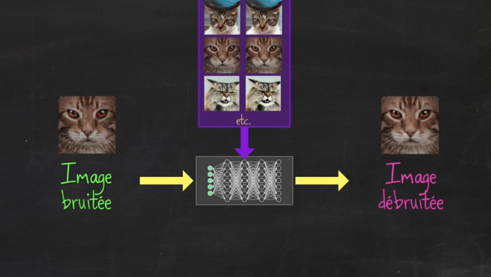
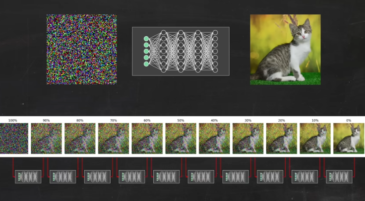
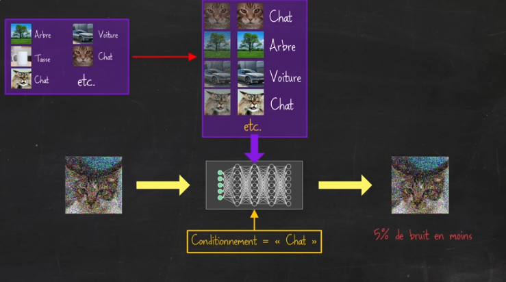
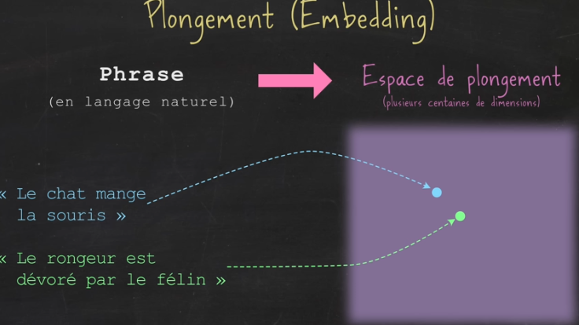
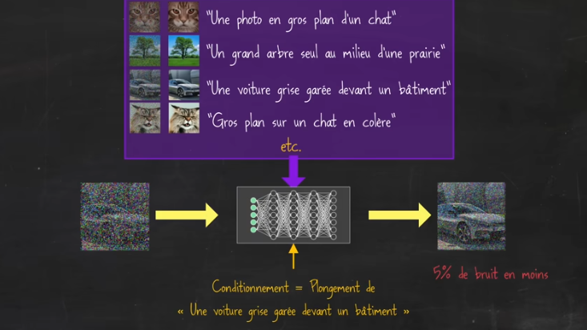
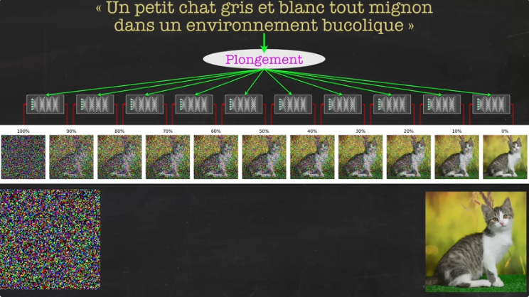

# Activité 2 : Comprendre les algorithmes de génération d'images.

Nous allons travailler avec l'**excellente** vidéo de David Louapre (de la chaîne YouTube [ScienceEtonnante](https://www.youtube.com/scienceetonnante){. target="_blank"})

<iframe width="683" height="384" src="https://www.youtube.com/embed/tdelUss-5hY?t=920" title="Comment ces IA inventent-elles des images ?" frameborder="0" allow="accelerometer; autoplay; clipboard-write; encrypted-media; gyroscope; picture-in-picture; web-share" referrerpolicy="strict-origin-when-cross-origin" allowfullscreen></iframe>

*Lire à partir de 15:20*

## 1. Le principe de fonctionnement des algorithmes de générations d'image par «diffusion»

### 1.1 Le débruitage progressif sur un seul type d'images 

- étape 1 : on bruite des images de chat
{: .center width=60%}

- étape 2 : on entraine un réseau de neurones à débruiter ces images de chat
{: .center width=60%}

- étape 3: une fois entrainé, on fait débruiter au réseau de neurones une image constituée de pixels aléatoires : cela «hallucine» un chat.
{: .center width=60%}

Sites permettant de générer :

- des fausses personnes : [https://thispersondoesnotexist.com/](https://thispersondoesnotexist.com/){. target="_blank"}
- des faux chats: [https://thesecatsdonotexist.com/](https://thesecatsdonotexist.com/){. target="_blank"}
- des fausses voitures: [https://www.thisautomobiledoesnotexist.com/](https://www.thisautomobiledoesnotexist.com/){. target="_blank"}

### 1.2 Le débruitage progressif polyvalent

{: .center width=60%}

Le réseau est maintenant entraîné à créer des images de plusieurs catégories différentes (chat, arbre, voiture...)

### 1.3 Le «plongement» de la phrase descriptive

Chaque instruction peut être «plongée» dans un espace mathématique selon le sens de ses mots:
{: .center width=60%}

On entraine notre réseau sur chacun de ces plongements :
{: .center width=60%}

Le réseau est maintenant capable de créer une image décrite en langage naturel, et non plus simplement par une catégorie donnée.

{: .center width=60%}

## 2. Sites de création d'images (sans connexion)

- Pour voir le débruitage progressif : [https://fr.vittascience.com/ia/image-generate.php](https://fr.vittascience.com/ia/image-generate.php){. target="_blank"}

- Pour avoir des images de bien meilleure qualité : [https://perchance.org/ai-text-to-image-generator](https://perchance.org/ai-text-to-image-generator){. target="_blank"}
