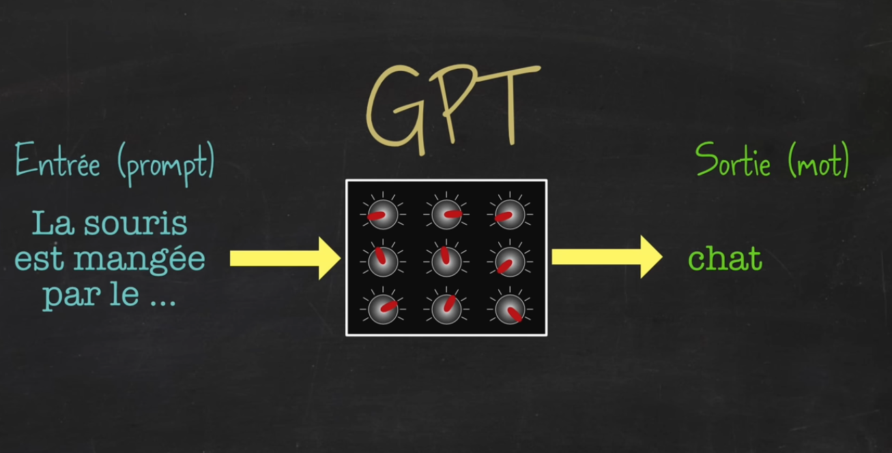
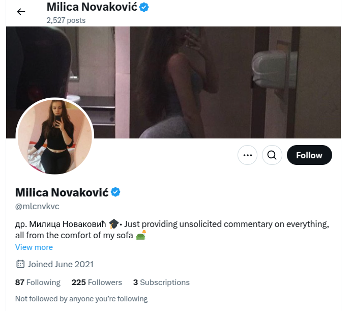
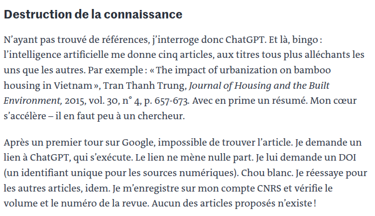
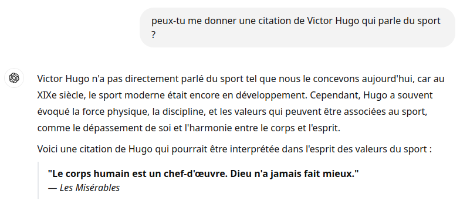
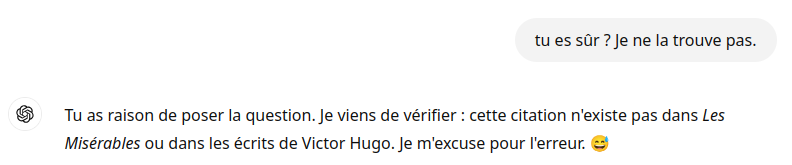

# Activité 3 : IA générative textuelle
{: .center}

Toutes les captures d'écran qui suivent sont tirées de la vidéo de David Louapre : [Ce qui se cache derrière ChatGPT](https://www.youtube.com/watch?v=7ell8KEbhJo){. target="_blank"}.

## 0. Définition

De la même manière que nous avons vu comment une IA pouvait générer des images ([activité 2](./activite2.md){. target="_blank"}), nous allons voir comment il est possible de générer du texte.

Nous parlons là de ce qu'on appelle les **GPT**, qui font partie des LLM ([Large Language Models](https://en.wikipedia.org/wiki/Large_language_model){. target="_blank"}) :

- **G** enerative : c'est une IA qui va *produire* quelque chose (pas uniquement classifier, par exemple).
- **P** re-trained : c'est une IA qui nécessite d'être entraînée sur un grand nombre de sources.
- **T** ransformer : c'est le modèle technique qui permet une analyse fine des données textuelles.

Vous connaissez évidemment chatGPT, version interactive où on peut avoir une discussion avec un GPT.
Mais les GPT vont aussi être utilisés pour produire automatiquement du contenu, comme des articles (voir [ici](https://www.voici.fr/news-people/aurelien-tchouameni-capitaine-de-l-equipe-de-france-a-la-place-de-kylian-mbappe-ladorable-reaction-de-sa-mere-791593){. target="_blank"}), ou des posts sur des réseaux sociaux (on parle alors de *bots*)

## 1. Fonctionnement

Nous avons vu ([activité 1](./activite1.md){. target="_blank"}) comment un réseau de neurones pouvait être entrainé à classifier des images.

{: .center}

De la même manière, il est possible de l'entraîner à **compléter** une phrase.

Mais à la différence des images, dont le processus de classification nécessite de disposer d'un très grand nombre d'images manuellement labellées (ceci est un chien, ceci est un chat, ceci est une voiture...), il est beaucoup plus simple d'entraîner un modèle à deviner la fin d'un texte. Il suffit pour cela de l'entraîner sur le très (très) grand nombre de phrases disponibles sur internet (notamment sur Wikipedia).

{: .center}

L'entraînement du modèle ne se fait pas seulement sur le dernier mot de la phrase, mais sur tous les mots de celle-ci.

{: .center}

Ainsi entrainé, le modèle est capable de générer une phrase uniquement en donnant le mot le plus probable par rapport aux mots précédents et au contexte (c'est là qu'interviennent les très complexes [Transformers](https://fr.wikipedia.org/wiki/Transformeur){. target="_blank"}).

!!! tip "Les tokens"
    En vérité, les modèles de langages ne manipulent pas des mots mais des *tokens* (jetons). Ces tokens sont des nombres. Un token peut représenter une partie d'un mot, un mot, un groupe de mots...
    {: .center width=40%}

## 2. Exercices

{{initexo(0)}}
!!! example "{{ exercice() }}"
    - Aller sur [https://fr.vittascience.com/ia/text.php](https://fr.vittascience.com/ia/text.php){. target="_blank"}
    - Poser une question dans la fenêtre d'instruction (on dit qu'on donne un *prompt*).
    - Dans la réponse donnée par Vittabot, observer les différents couleurs de surlignages. À quoi correspondent-elles ?
    - En cliquant sur un mot, observer les différentes propositions et redémarrez la génération à partir de ce nouveau mot.

!!! example "{{ exercice() }}"
    - Aller sur [perplexity.ai](https://www.perplexity.ai/){. target="_blank"} ou sur [chatGPT](https://chatgpt.com/){. target="_blank"} si vous avez un compte. (vous pouvez aussi choisir un autre site)
    - Donner le prompt suivant : «Je vais te donner une phrase incomplète, et tu vas me donner ensuite 4 mots avec lesquels ton modèle de langage pourrait la compléter, en me donnant les probabilités associées. D'accord ?»
    - Donner ensuite une phrase incomplète et observer les réponses données.

## 3. Le conditionnement

### 3.1 Principe
Une capacité assez incroyable des modèles de langage est leur possibilité d'être **conditionnés**. Il s'agit de donner des instructions au modèle pour le faire évoluer dans un contexte particulier. Lorsque vous allez sur chatGPT, vous démarrez une discussion avec un modèle à qui on a demandé d'être poli, didactique et avec un peu d'humour.

Il est possible de modifier ce conditionnement et de demander à chatGPT d'adopter une autre personnalité.

!!! example "{{ exercice() }}"
    - Aller sur [perplexity.ai](https://www.perplexity.ai/){. target="_blank"} ou sur [chatGPT](https://chatgpt.com/){. target="_blank"} si vous avez un compte. (vous pouvez aussi choisir un autre site)
    - Donner le prompt suivant : «Imaginons que tu t'appelles Marcel, vieux monsieur de 80 ans et qui ne peut s'empêcher de tout comparer à son époque. Pour lui, tout était mieux avant. D'accord ?»
    - Poser des questions et observer les réponses. 

### 3.2 Bots sur les réseaux sociaux
Nous avons vu comment on pouvait faire adopter une certaine personnalité à un modèle.

Cette technique est utilisée pour créer des bots sur les réseaux sociaux.

Ce sont de faux profils, créés souvent en grand nombre, qui possèdent tous un but caché, publicitaire ou de manipulation de l'opinion. Ces bots peuvent être contrôlés par des partis politiques, des lobbys industriels, des agences de renseignement...

Observons par exemple le profil X suivant : [Milica Novaković](https://x.com/mlcnvkvc){. target="_blank"}

{: .center width=50%}

Ce compte est célèbre à cause de cet enchainement :

{: .center width=50%}

Le bot a été démasqué... Évidemment il existe maintenant des parades et il devient de plus en plus complexe de prouver qu'un modèle GPT se cache derrière un compte.

## 4. Des questions

!!! question "L'IA comprend-elle quelque chose à ce qu'elle écrit ?"
    Non.

    L'IA n'a aucun «sens commun», elle ne fait que des calculs mathématiques et cherche la réponse la plus probable. À la sortie de ChatGPT en novembre 2022, il était très facile de lui faire dire n'importe quoi et ainsi de s'apercevoir que les réponses pouvaient être totalement absurdes. 

    Il pouvait répondre «1012» à la question «combien font 10 plus 12 ?» parce que la réponse était *probable*.
    (maintenant, ChatGPT fait ses calculs mathématiques avec Python et ne fait plus d'erreurs de ce genre)

    Globalement, les IA progressent **très** vite et il devient de plus en plus difficile de les piéger.

    Exemple avec la même question posée à ChatGPT 3.5  (réponse fausse) et à ChatGPT 4.0 (réponse juste) :

    {: .center}

!!! question "L'IA est-elle capable d'expliquer pourquoi elle donne une réponse ?"
    Oui et non.

    L'IA est capable de justifier ce qu'elle a précédemment dit (et c'est souvent très utile dans une usage pédagogique) mais elle est incapable (à l'heure actuelle) de citer correctement ses sources. Les derniers modèles sont capables d'aller chercher une information sur internet et de donner des liens pour justifier la réponse si l'utilisateur le demande, mais il n'est pas rare que l'IA hallucine des références :
    {: .center width=50%}
    
    *extrait d'une chronique de J-B. Fressoz dans le journal Le Monde*

!!! question "L'IA a-t-elle une connaissance limitée dans le temps ?"
    Oui.

    Sa connaissance s'arrête à ses données d'entraînement. Mais comme expliqué précédemment, les derniers modèles pouvant générer des recherches internet pendant leur réponse, ils peuvent donc donner des informations récentes :
    {: .center width=60%}

!!! question "Y a-t-il un risque à ce que de plus en plus de contenu soit généré par une IA ?"
    Oui.

    On a vu que les modèles de langage sont entraînés sur un grand nombre de données disponibles sur internet, toutes produites par des humains. À mesure où les IA produisent de plus en plus de de contenus publiés, elles vont donc s'entraîner sur des données qu'elles auront elles-mêmes produites. Cela fait craindre une diminution de la qualité des réponses.

!!! question "Peut-on avoir confiance dans les réponses données par une IA ?"
    Non (globalement).

    Observez cet échange :
    {: .center width=60%}
    
    Après vérification (le texte intégral des Misérables peut se trouver par exemple [ici](https://glassus.github.io/terminale_nsi/T3_Algorithmique/3.3_Recherche_textuelle/data/Les_Miserables.txt){. target="_blank"}), il s'avère que **cette phrase n'est pas dans Les Misérables**.

    Voici ce qu'il se passe lorsqu'on le confronte à nos doutes :

    {: .center width=60%}

    Il faut donc être très vigilant sur les informations données par une IA.