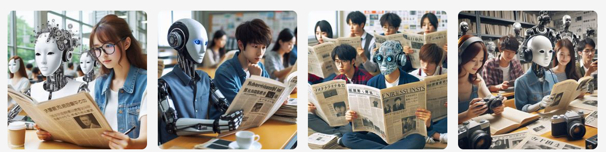
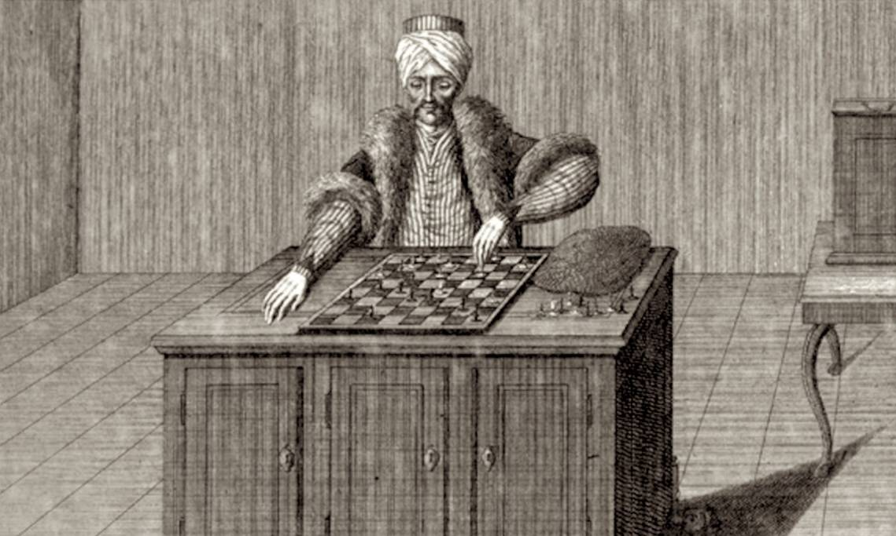
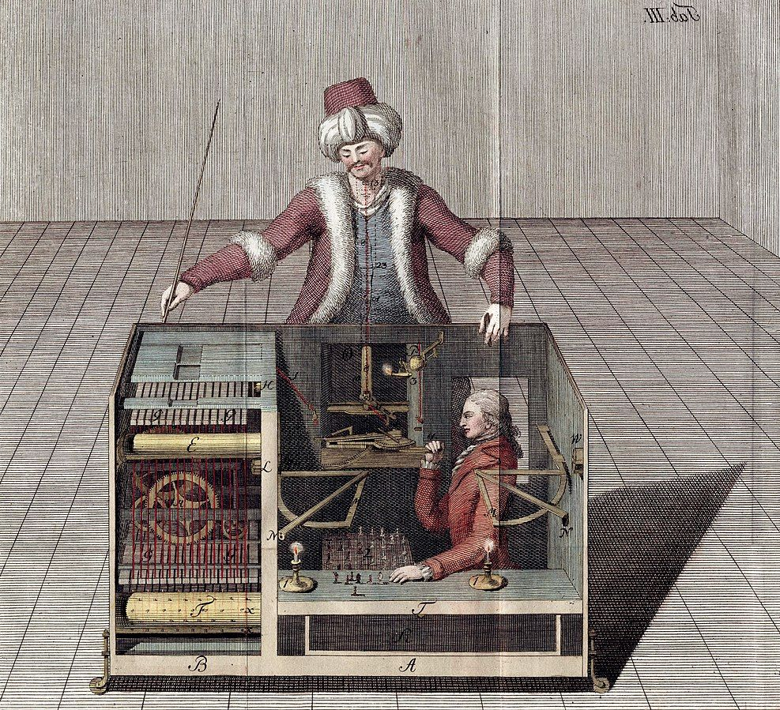
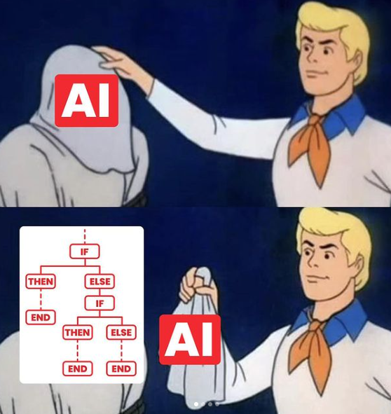
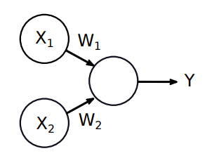
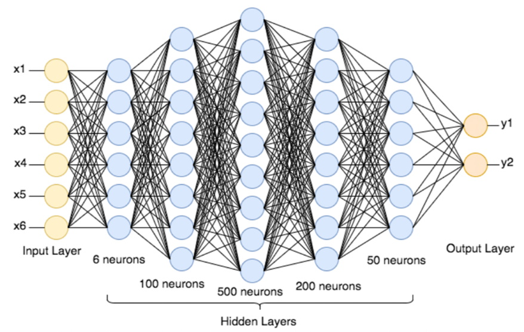
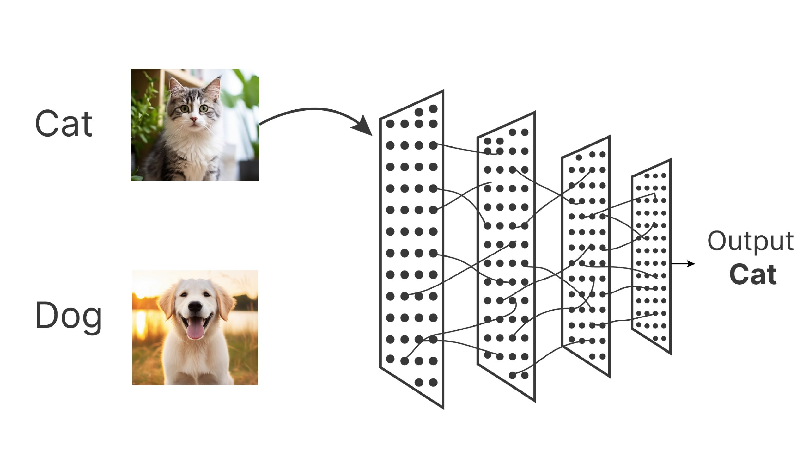

# Projet SNT-EMC : L'Intelligence Artificielle et l'information

:arrow_right: rendez-vous sur [Lycée Connecté](https://jeunes.nouvelle-aquitaine.fr/formation/au-lycee/lycee-connecte-ent){. target="_blank"} pour répondre au sondage sur l'IA.

{: .center}

*Images générées par Bing avec le prompt : «des élèves qui étudient l'influence de l'Intelligence Artificielle sur les journaux, style photographique»*


## 1. L'avènement de l'Intelligence Artificielle

### 1.1 Tentative de définition

!!! info "L'Intelligence Artificielle"
    D'après Wikipedia, 

    *«L'intelligence artificielle est un ensemble de théories et de techniques visant à réaliser des machines capables de simuler l'intelligence humaine.»*

Mais définir l'Intelligence Artificielle présuppose donc de savoir définir l'intelligence humaine, ce qui n'est pas une mince affaire... En étant moins ambitieux, on peut dire qu'une Intelligence Artificielle devrait être capable de résoudre les problèmes qu'un être humain sait résoudre.

### 1.2 Un long chemin
L'être humain a toujours essayé de se débarasser des tâches répétitives en cherchant à les automatiser.
On peut penser aux usines dont les machines mécaniques permettent une grande productivité.

Mais cette recherche d'une «machine efficace» s'est très vite aussi portée sur des aspects de la vie quotidienne où seule la réflexion est en jeu. Par exemple, peut-on fabriquer une machine qui joue aux échecs ?

!!! abstract "le Turc mécanique"
    À la fin du XVIIIème siècle, un «automate joueur d'échec» fit sensation :
    {: .center width=40%}
    Un mécanisme interne semblait calculer des coups aux échecs et on pouvait ainsi «jouer contre une machine».

    Mais la supercherie fut découverte, il y avait quelqu'un à l'intérieur de la machine...

    {: .center width=30%}

    *source : [Wikipedia](https://fr.wikipedia.org/wiki/Turc_m%C3%A9canique){. target="_blank"}*
    

L'expression «Turc mécanique» est restée pour désigner les arnaques où derrière une pseudo-IA se cache une intervention humaine. Dernièrement, une société française commercialisant un logiciel censé détecter automatiquement les vols dans les supermarchés par analyse des images a été soupçonnée d'utiliser des humains (basés à Madagascar) chargés de faire de la simple surveillance visuelle... (source : [La Quadrature du Net](https://www.laquadrature.net/2024/07/18/veesion-et-surveillance-en-supermarches-vraie-illegalite-faux-algorithmes/){. target="_blank"})

### 1.3 Les systèmes experts

Depuis l'avènement de l'informatique, la programmation a permis de faire des programmes de plus en plus évolués. Derrière l'écran de l'ordinateur ou du téléphone se retrouvent des prouesses électroniques et de miniaturisation mécanique. Certains pensent que les ordinateurs (et donc les téléphones) sont les objets les plus complexes jamais fabriqués par l'humanité. Et que personne sur Terre actuellement n'est capable de comprendre la totalité du fonctionnement de ces machines. Mais à ces prouesses électroniques et mécaniques s'ajoutent un autre travail remarquable : le travail d'écriture du code informatique.

Il est beaucoup plus simple à appréhender : il ne s'agit «que» d'un code composé de structures de contrôles élémentaires.

Prenons le code ci-dessous :
```python linenums='1'
a = 1
while a < 10:
    print("Hello world!")
    if a == 5:
        print("Hi there")
    a = a + 1
```
Il contient quasiment toutes les structures élémentaires (l'affectation, la boucle, le test) qui composent n'importe quel code informatique très évolué, comme celui du navigateur web que vous utilisez.

L'essor de l'informatique (parallèlement à celui de la fabrication de semi-conducteurs) a vu naître des programmes de plus en plus complexes, appliqués à tous les domaines de la société. Toujours dans l'idée d'automatiser les tâches fastidieuses, des programmes ont été créés pour faire le travail des humains. Ces programmes sont regroupés sous le nom «systèmes experts», capables de calculer et de donner un résultat à un problème donné beaucoup plus rapidement qu'un humain.

Certains de ces programmes se sont alors réclamés de *l'Intelligence Artificielle*. Comme on l'a vu, pour dire que ce n'en est pas, encore faudrait-il être capable de dire ce qui en est. Une chose est sûre : ces programmes ne reposaient «que» sur un ensemble de structures élémentaires, et chacune des décisions prises correspondaient à un cas précis du programme, à un cas prévu par le programmeur. Les résultats étaient **explicables** et **reproductibles** (nous en reparlerons...).

{: .center width=40%}

En 1996, l'ordinateur [Deep Blue](https://fr.wikipedia.org/wiki/Deep_Blue){. target="_blank"} d'IBM a battu le champion du monde d'échecs Gary Kasparov. Comme on l'a vu avec le Turc mécanique, le jeu d'échecs a toujours été considéré comme un «révélateur d'intelligence», et avoir construit une machine capable de battre le meilleur joueur du monde a été perçu par beaucoup comme l'avènement d'une réelle Intelligence Artificielle.

Mais Deep Blue restait un programme «classique», qui obéit à des règles écrites par ses programmeurs : il tirait sa force des millions de parties analysées et de sa puissance de calcul hors du commun pour l'époque.


### 1.4 Changement de stratégie et accélération brutale

Dans les années 80 va naître un nouveau champ de recherche : la création des réseaux de neurones. Le nom peut prêter à confusion : il ne s'agit pas d'essayer de reconstituer un cerveau, mais plutôt d'essayer de répondre à des problèmes de classification par une succession d'opérations mathématiques élémentaires.

Un «neurone» va ressembler à ceci *(image N.Rougier)*:
{: .center width=20%}

Ici $X_1$ et $X_2$ sont des nombres (les *données d'entrée*), $W_1$ et $W_2$ sont aussi des nombres (appelés les *poids*) et $Y$ va être le nombre de sortie.

On a $Y=W_1 \times X_1 + W_2 \times X_2$

!!! tip "Idée générale du fonctionnement d'un neurone en apprentissage supervisé"
    - On connait les valeurs de $X_1$ et de $X_2$.
    - On connait la valeur de $Y$ que l'on devrait trouver (car l'apprentissage est supervisé : on connait déjà le résultat final, on entraîne juste le neurone)
    - On ajuste les poids $W_1$ et $W_2$ pour trouver la bonne valeur de $Y$.
    - Une fois trouvées les bonnes valeurs de $W_1$ et $W_2$, on peut changer donner des nouvelles valeurs inconnues à $X_1$ et $X_2$ et regarder la «prédiction» $Y$. 


Voilà le fonctionnement minimal... sachant que ces neurones, organisés en couches (on parle de *réseaux de neurones*), sont au nombre de... 100 000 000 000 000 pour Chat-GPT 4 (soit $10^{14}$, cent mille milliards).

{: .center width=50%}


Comment gérer autant de paramètres en même temps ? Il a fallu la conjonction de gros progrès algorithmiques (notamment par le Français [Yann Le Cun](https://fr.wikipedia.org/wiki/Yann_Le_Cun){. target="_blank"} et sa découverte de la rétro-propagation du gradient, qui fait que les poids «s'ajustent» automatiquement) et de gros progrès techniques (des cartes graphiques de plus en plus puissantes) pour que ces algorithmes à base de réseaux de neurones prennent leur envol durant les 5 dernières années.

Parmi ces algorithmes, commençons par les algorithmes de classification :

## 2. Les algorithmes de classification

Comment un programme pourrait-il faire la différence entre une photo de chat et une photo de chien ?

L'approche «système expert» serait d'essayer de lui lister toutes les caractéristiques qui différencient ces deux animaux, puis d'essayer d'analyser les pixels pour y trouver ces caractéristiques.

```python linenums='1'
# SI le visage est petit et triangulaire 
#    ALORS c'est un chat.
#
# SI les oreilles sont larges et tombantes 
#    ALORS c'est un chien
```

Disons-le clairement : ça marche très mal.

L'idée d'un algorithme basé sur des réseaux de neurones va être de dire : on ne va jamais essayer d'écrire les règles qui différencient les chats et les chiens.
On va plutôt donner à ce programme un ensemble de photos de chat labellisées comme des photos de chat, et des photos de chiens labellisées comme des photos de chien.

Et on lui demande de deviner si la photo présentée est celle d'un chien ou d'un chat. 

Une photo, c'est un ensemble de pixels. Mais un ensemble de pixels, c'est un ensemble de nombres. Donc «analyser» une photo, c'est prendre en entrée *beaucoup* de nombres (plusieurs millions) et demander en sortie... deux nombres ! 

Par exemple : soit 0 (c'est un chat), soit 1 (c'est un chien).

La transformation de ces nombres a lieu dans un réseau de neurones comme présenté plus haut.

Au début, les réponses sont équivalentes à une réponse aléatoire. Le réseau de neurones répond à peu près n'importe quoi. Mais comme on sait ce qu'*aurait dû* être la réponse, il peut mettre à jour ses poids (la fameuse *rétro-propagation*) pour corriger son erreur.

Et petit à petit, les poids vont se stabiliser. On dira que **le modèle a été entrainé**. On peut maintenant lui donner une nouvelle photo à analyser, et souvent... ça marche !

!!! abstract ":warning: Mais pourquoi ça marche ? :warning:"
    C'est un point **crucial** qu'il faut avoir compris : contrairement aux programmes «classiques», le résultat affiché («chien» ou «chat») n'est pas le résultat d'un parcours d'embranchements logiques écrits par le programmeur. L'ajustement automatique des poids du réseau de neurones ne peut pas s'expliquer par des règles logiques. Il faut donc accepter d'avoir un résultat sans explication. Dans certains domaines très sensibles, ce n'est pas acceptable. Un champ de recherche est actuellement très actif autour de [l'IA explicable](https://www.ibm.com/fr-fr/topics/explainable-ai){. target="_blank"}


{: .center width=60%}


[ :arrow_right: Activité 1 :  Utilisation d'un algorithme de classification](../activite1/){ .md-button }

## 3. L'Intelligence Artificielle Générative

La mise à disposition du grand public de ChatGPT, en Novembre 2022, a propulsé l'Intelligence Artificielle sur le devant de la scène médiatique. Il ne s'agissait plus d'algorithmes de classification, à l'intérêt limité pour le grand public, mais d'algorithmes capables de «fabriquer tout seuls» des choses : du texte (comme [ChatGPT](https://chatgpt.com/){. target="_blank"}, ou [Perplexity](https://www.perplexity.ai/){. target="_blank"}, [ MistralAI](https://mistral.ai/fr/){. target="_blank"}) ou des images (comme [Dall-e](https://openai.com/index/dall-e-3/){. target="_blank"} ou  [Midjourney](https://www.midjourney.com/home){. target="_blank"}).

ChatGPT est un **agent conversationnel**, c'est-à-dire un programme qui va produire du texte, en adaptant ses réponses aux phrases précédemment écrites par son interlocuteur humain. Nous l'étudierons plus tard.

Midjourney est un **générateur d'images**, c'est-à-dire un programme qui va produire une image à partir d'un texte donné par un interlocuteur humain.

### 3.1 Comment marchent les algorithmes générateurs d'images ?

[ :arrow_right: Activité 2 :  Algorithmes générateurs d'images](../activite2/){ .md-button }

### 3.2 Comment marchent les algorithmes générateurs de texte ?

[ :arrow_right: Activité 3 :  IA générative textuelle](../activite3/){ .md-button }

??? quote "bibliographie"
    - [https://www.analyticsvidhya.com/blog/2021/06/beginner-friendly-project-cat-and-dog-classification-using-cnn/](https://www.analyticsvidhya.com/blog/2021/06/beginner-friendly-project-cat-and-dog-classification-using-cnn/){. target="_blank"}
    - [https://scienceetonnante.com/2023/01/13/stable-diffusion/](https://scienceetonnante.com/2023/01/13/stable-diffusion/){. target="_blank"}

    