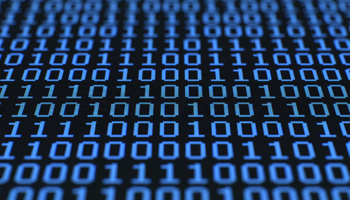

# Le binaire et le codage de l'information numérique

{: .center}


## 1. Le système décimal

Notre mode de numération est le système *décimal*, ou système de base 10.

Chaque nombre s’écrit avec les 10 chiffres 0 1 2 3 4 5 6 7 8 9.

Chaque chiffre correspond à un rang, qui est celui d’une puissance de 10.


Prenons par exemple le nombre en écriture décimale $5603_d$ (le petit *d* en indice est là pour rappeler que le nombre
est écrit en écriture décimale).

Le chiffre 5 est dans le rang des milliers, donc de $10^3$ .

On peut donc écrire :

$\texttt{5603}_d=\texttt{5} \times 10^3 + \texttt{6} \times 10^2 + \texttt{0} \times 10^1 + \texttt{3} \times 10^0$

{: .center width=50%}


Ce système de base 10 provient (très probablement) du fait que les humains ont dix doigts.

De cette manière, on pourrait imaginer que dans leur univers, les Simpsons compteraient en base 8 car ils n'ont que 4 doigts à chaque main (voir exercice 2).


## 2. Le système binaire

Les appareils électroniques (ordinateurs, calculatrices, téléphones, etc.) travaillent avec un système de représentation des nombres différent, le système binaire. Dans ce système, appelé aussi système de base 2, chaque nombre
s’écrit avec les deux chiffres 0 et 1 (correspondant en fait au passage ou non d’un courant électrique dans un
transistor). Chaque chiffre correspond à un rang, qui est celui d’une puissance de 2.

### 2.1 Du binaire au décimal

Prenons par exemple le nombre en écriture binaire $\texttt{1101}_b$.

Pour connaître la valeur de $\texttt{1101}_b$ en écriture décimale on peut donc s'aider du tableau :

{: .center width=50%}


Donc le nombre 1101 écrit en binaire correspond au nombre 13 écrit en décimal.


!!! example "{{ exercice() }}"
    === "Énoncé"
        1. Donner l’écriture décimale du nombre $10111_b$ .
        2. Quelle est la valeur (en écriture décimale) du plus grand nombre binaire écrit sur un octet ? (un octet = 8
        bits)
        3. Expliquer cette blague d’informaticiens :
        « Dans la vie, il y a 10 sortes de personnes : celles qui connaissent le binaire, et celles qui ne le connaissent
        pas. »
    
    === "Correction"
        
        1. $10111_b=16+4+2+1=23_d$
        2. Le plus grand octet s'écrit en binaire $11111111_b$, qui vaut en décimal $128+64+32+16+8+4+2+1=255$.
        3. Le «10» est à comprendre en binaire, c'est-à-dire 2 en décimal.
        
        


!!! example "{{ exercice() }}"
    === "Énoncé"
        Dans l'univers des Simpsons, que vaut le nombre $\texttt{63}_s$ écrit en décimal ?
    === "Correction"
        {#
        $6 \times 8^1 + 3 \times 8^0 = 51$ 

        $\texttt{63}_s$ correspond donc à 51 en décimal.
        #}

### 2.2 Du décimal au binaire

Principe : dans chaque nombre décimal, il existe une plus grande puissance de 2 qui est inférieure au nombre.

Par exemple, dans 243, il y a 128. Donc

{: .center width=80%}

Donc $243_{10}=11110011_2$

!!! info "Méthode des divisions successives"
    {: .center width=40%}
    

!!! example "{{ exercice() }}"
    === "Énoncé"
        Donner l'écriture binaire du nombre $186_d$.
    === "Correction"
        
        $186_d=10111010_b$
        

!!! example "{{ exercice() }}"
    === "Énoncé"
        Que devient l’écriture binaire d’un nombre lorsqu’on le multiplie par 2 ?
    === "Correction"
        
        Sur des exemples : 

        - 3 s'écrit 11 en binaire, son double 6 s'écrit 110 en binaire.
        - 12 s'écrit 1100 en binaire, son double 24 s'écrit 11000 en binaire.
        - 50 s'écrit 110010 en binaire, son double 100 s'écrit 1100100 en binaire.
        
        On peut alors conjecturer que multiplier par 2 revient à **rajouter un 0 dans l'écriture binaire**. 
        

## 3. Codage et transmission de l'information

Voici la table [ASCII](https://fr.wikipedia.org/wiki/American_Standard_Code_for_Information_Interchange) (American Standard Code for Information Interchange)

{: .center width=60%}

Le mot «OK» sera donc codé en binaire par ```0100111101001011``` .

Si on veut transmettre le mot «OK», il faut donc transmettre ces 16 bits d'information. La vitesse à laquelle on va les transmettre s'appelle le **débit**. Par exemple, si on transmet 1 bit par seconde, le débit sera de 1 b/s. 

Le débit moyen lors d'une connexion en 5G est de 450 Mb/s, soit 450 000 000 b/s...


!!! example "{{ exercice() }}"
    === "Énoncé"
        En vous répartissant le travail, décodez la phrase (codée en décimal) :
        74, 39, 65, 73, 77, 69, 32, 76, 69, 32, 66, 73, 78, 65, 73, 82, 69
    === "Correction"
        
        "J'AIME LE BINAIRE"
        

{#
01010011
01001110
01010100

#}

## 4. Annexe : le message secret de Perseverance

Voir [ici](https://glassus.github.io/snt/Theme0_Bases_de_Python/Exercice_Perseverance/){. target="_blank"}

