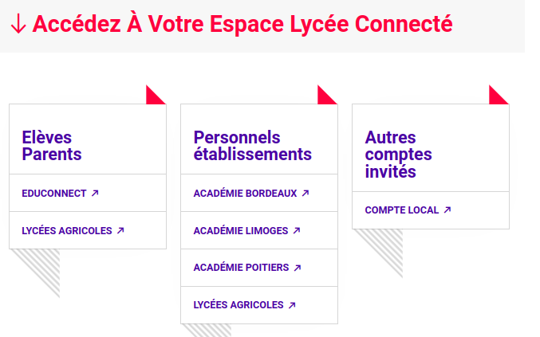

# La plateforme d'apprentissage Moodle

Moodle est une plateforme d'apprentissage à distance utilisée massivement à travers le monde (surtout à l'université). Elle est disponible au sein de notre Environnement Numérique de Travail LycéeConnecté.

## Se connecter à LycéeConnecté

1. Rendez-vous à l'adresse [https://lyceeconnecte.fr/](https://lyceeconnecte.fr/).
{: .center width=50%}

2. Cliquez sur EduConnect. Utilisez les identifiants utilisés l'année précédente.
1. Une fois sur LycéeConnecté, cliquer sur *Mes Applis* puis rendez-vous sur Moodle.
{: .center}
1. Dans *Mes cours* vous devriez retrouver votre cours de SNT :
{: .center}
Un questionnaire de rentrée vous y attend.

