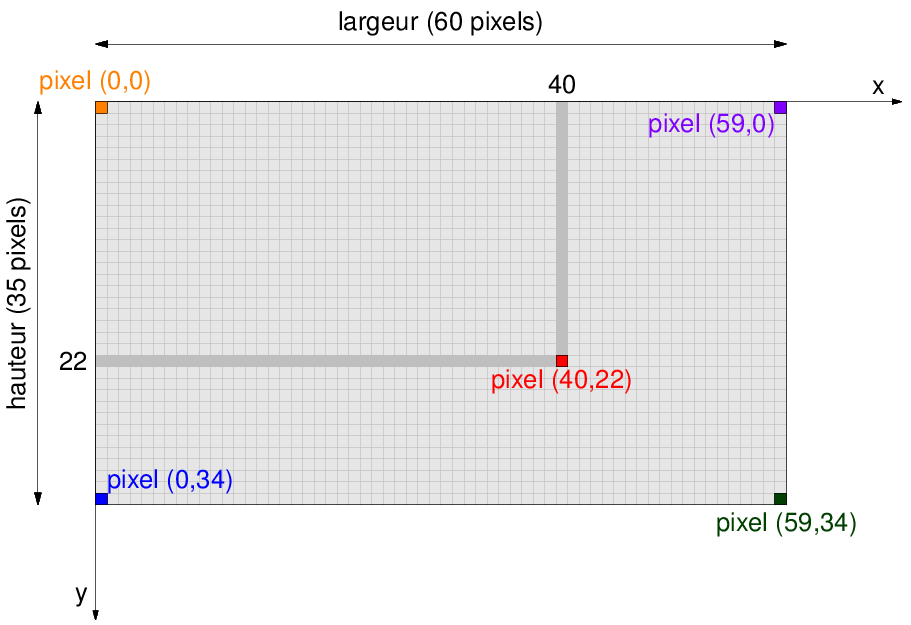
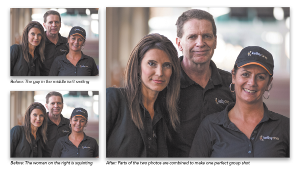

# L'image numérique

## 1. Vidéo introductive
<iframe width="790" height="444" src="https://www.youtube.com/embed/UnNPNc-F9ks" title="YouTube video player" frameborder="0" allow="accelerometer; autoplay; clipboard-write; encrypted-media; gyroscope; picture-in-picture" allowfullscreen></iframe>

## 2. Le pixel

### 2.1 Une image est composée de pixels
Le **pixel** (contraction de «Picture Element») est l'élément de base d'une image numérique.

Une image numérique se présente sous la forme d’un quadrillage - ou d'un tableau - dont chaque case est un pixel d’une couleur donnée. On peut donc repérer chaque pixel par sa ligne et sa colonne dans ce quadrillage, à l'aide de coordonnées en partant du coin en haut à gauche
{: .center }

### 2.2 Comment un écran affiche-t-il des pixels ?

L'observation à la loupe de différents écrans de téléphone donne ceci :
{: .center}

Pour afficher une image sur un écran de téléphone, seules trois couleurs sont donc disponibles : le rouge, le vert et le bleu.
Comment ces 3 couleurs peuvent-elles générer toutes les autres couleurs ?


## 3. Le codage RGB


!!! info "Le codage RGB"
    Chaque pixel correspond à un triplet de trois nombres entiers, soit les valeurs de rouge (Red), de vert (Green) et de bleu (Blue) afin de reconstituer la couleur. Chaque valeur est codée entre 0 et 255. On parle de code RGB (RVB in français).

    {: .center} 
    
    Plus de renseignements sur la méthode additive peuvent être retrouvés [ici](http://physique.ostralo.net/syntheses_couleurs/){. target="_blank"}.

    À noter qu'une couleur dont les 3 composantes sont identiques correspond à un niveau de gris.


[Ce site](https://www.w3schools.com/colors/colors_rgb.asp){. target="_blank"} (parmi beaucoup d'autres !) permet de retrouver le codage RGB d'une couleur. Il permet aussi de trouver le codage html d'une couleur, qui est basé sur le système hexadécimal.


!!! abstract "Activité 1 sur Capytale : modification en Python des couleurs d'une image"
    - Cliquez sur [ce lien](../modification_image/){. target="_blank"}.


!!! abstract "Activité 2 sur Capytale : Incrustation d'une image en Python"
    - Cliquez sur [ce lien](../incrustation_image/){. target="_blank"}.


{#
??? info "la base 16 : l'hexadécimal"
    L'inconvénient essentiel du système binaire est la longueur de l'écriture des nombres qu'il génère. Pour cette raison, le **système hexadécimal**, ou système de **base 16** est très souvent employé.

    - Pour écrire en base 2, il faut 2 chiffres différents : le 0 et le 1.  

    - Pour écrire en base 10, il faut 10 chiffres différents: 0,1,2,3,4,5,6,7,8,9.  

    - Pour écrire en base 16, il faut donc 16 chiffres différents : **0,1,2,3,4,5,6,7,8,9,A,B,C,D,E,F**.    


    On a donc la correspondance :

    - A représente 10  
    - B représente 11  
    - C représente 12  
    - D représente 13  
    - E représente 14  
    - F représente 15 

    |256|16|1|
    |:---:|:---:|:---:|
    |$16^2$|$16^1$|$16^0$|
    | 1| D|2|


    $\rm{1D2}_{16}=1 \times 16^2+ 13 \times 16^1+2 \times 16^0=256+208+2=466_{10}$
    
    Le nombre hexadécimal `1D2` correspond donc au nombre décimal 466.
    
    
    En pratique, l'hexadécimal est surtout utilisé pour sa capacité à représenter la valeur de n'importe quel octet sur 2 chiffres ("chiffres" étant à prendre au sens large = chiffres ou lettres !).
 
    !!! example "Exercice"
        === "Énoncé"
            1. Donner la valeur des octets `FF`, `3A`, `B2`.
            2. Expliquer pourquoi la couleur RGB (138,255,51) a pour code html `#8AFF33`.
            3. Quelle est la couleur html du blanc ?
#}


!!! example "Exercice 1"
    !!! tip inline end "les préfixes"
        - **Ko** : kilo -> $10^3$
        - **Mo** : méga -> $10^6$
        - **Go** : giga -> $10^9$
        - **To** : téra -> $10^{12}$
        - **Po** : péta -> $10^{15}$
        - **Eo** : exa -> $10^{18}$

    Si je possède une image de 600 pixels sur 400 pixels, quel est le poids (en octets, puis en Ko, puis en Mo) de cette image ?
    
    On considèrera que le fichier ne contient que les informations relatives à chaque pixel, et qu'aucun algorithme de compression n'a été utilisé.

    {{
    correction(True,
    """
    ??? success \"Correction\" 
        Nombre de pixels :

        $600 \\times 400 = 240000$.

        Chaque pixel nécessite 3 octets, donc le poids total de l'image est $240000 \\times 3 = 720000$ octets, soit 720 Ko, ou encore 0,72 Mo.
    """
    )
    }}
   


        

!!! example "Exercice 2"

    Un ami m'envoie une photo de ses vacances. Le fichier de son image (en admettant qu'il ne contienne que le codage des pixels et rien d'autre, ce qui est faux...) commence par ceci :

    ```000011000001000111100110000011010001000111100100000010100000111111101000...```
    
    Est-ce que mon ami a beau temps pour ses vacances ? 

    *Aide : pour vous éviter des calculs, vous pouvez utiliser le convertisseur binaire-décimal disponible à [cette adresse](https://sebastienguillon.com/test/javascript/convertisseur.html){. target="_blank"}.*

    {{
    correction(True,
    """
    ??? success \"Correction\" 
        Les 3 premiers octets de cette série de bits nous donneront les valeurs R, G, B du premier pixel en haut à gauche de l'image.

        Prenons donc les 24 premiers bits : ```000011000001000111100110```.

        Ils se décomposent en 3 octets : ```00001100``` ,  ```00010001``` et ```11100110```.

        Ils correspondent respectivement aux valeurs décimales 12, 17 et 230.

        La couleur du premier pixel en haut à gauche est donc (12,17,230). Cette couleur est un [bleu](https://www.google.com/search?q=rgb+(12%2C17%2C230)){. target=\"_blank\"}.  On peut donc supposer que mon ami a beau temps pour ses vacances.
    """
    )
    }}
        


        

!!! abstract "Conclusion :heart: :heart: :heart:"
    - Les écrans (téléphones, ordinateurs, télévisions) sont constitués de pixels eux-mêmes constitués de sous-pixels rouge, vert ou bleus, posés sur une dalle noire.
    - En allumant ces sous-pixels avec différentes intensités, on peut générer toutes les couleurs.
    - Pour pouvoir donner ces instructions d'allumage à différentes intensités, le processeur qui gère ces pixels reçoit pour chacun d'entre eux trois nombres, pour chacun des sous-pixels.
    - Ces nombres sont écrits en binaire et sont codés sur un octet : ces nombres sont donc compris entre 0 et 255.
    - ```(0,0,0)```  est le code RGB du noir, ```(255,255,255)```  est le code RGB du blanc. Il y a plus de 16 millions de combinaisons possibles ($256^3=16777216$). Vous pouvez les tester [ici](https://www.w3schools.com/colors/colors_rgb.asp){. target="_blank"}.


Nous allons maintenant essayer de répondre à la question suivante : comment la lumière extérieure est transformée en une multitude d'informations de rouge, de vert et de bleu ?


## 4. De la lumière aux pixels : le fonctionnement de l'appareil photo numérique

### 4.1 Un peu d'histoire

{: .center }

L'ancêtre de la photographie numérique, appelé *photographie argentique*, fonctionnait grâce à des réactions chimiques successives, permettant de fixer sur du papier la lumière capturée par l’objectif de l’appareil photo.

La photographie numérique consiste à convertir en signaux **numériques** cette lumière capturée par l’objectif.


### 4.2 Le capteur de l'appareil photo numérique

Comme évoqué précédemement, le principe physique de fonctionnement d’un écran impose qu’il reçoive une information décomposée en niveaux de rouge, de vert et de bleu. Le procédé technique fondamental de la photographie numérique est donc la décomposition de la lumière visible suivant ces trois composantes : c’est le rôle de la **matrice de Bayer**.

{: .center}

Pour résumer, la matrice de Bayer va convertir la lumière visible en courant électrique (plus ou moins fort) selon la quantité de lumière verte, rouge ou bleue qui aura été reçue dans les photosites: 

<iframe title="vimeo-player" src="https://player.vimeo.com/video/103279733?h=cb66e06da5" width="640" height="360" frameborder="0" allowfullscreen></iframe>

{#
<iframe width="640" height="360" src="https://www.youtube.com/embed/eY4s1sVsiAM" title="YouTube video player" frameborder="0" allow="accelerometer; autoplay; clipboard-write; encrypted-media; gyroscope; picture-in-picture" allowfullscreen></iframe>
#}

Les photosites jouent un rôle dans la captation de la lumière,  à l’intérieur du capteur de l’appareil photo numérique, alors que les pixels de l’écran servent à reproduire cette lumière.
Lorsque les fabricants d’appareil photo ou de smartphones communiquent sur le nombre de mégapixels, ils font référence à la définition maximale (en nombre de pixels ) que pourra avoir l’image une fois affichée.
Ce nombre de mégapixels n’est pas égal au nombre de photosites. En effet, des procédés algorithmiques permettent maintenant de deviner de nouveaux pixels (on parle d’interpolation) non captés par les photosites.


## 5. Exemples d'algorithmes de traitement d'image : peut-on encore croire une photo ?


La qualité des photographies prises par les appareils photo numériques ou les smartphones augmente d’année en année.  
Il devient de plus en plus facile de réaliser une photographie qui satisfait nos attentes. Si des progrès ont eu lieu dans le domaine de l’optique, c’est essentiellement aux progrès fulgurants des algorithmes de traitement d’images que l’on doit la satisfaction d’une photographie réussie.  
Les algorithmes présentés ci-dessous peuvent être utilisés en post-traitement de photographie (sur un ordinateur avec un logiciel dédié), par le biais d’un filtre appliqué sur un réseau social, ou même de manière automatique lors de la prise de vue, lorsque ces algorithmes sont implémentés dans l’appareil photo numérique.

Il est important de comprendre que des algorithmes d'amélioration d'images sont appliqués **même si l'utilisateur ne les a pas sélectionnés**. Vous pouvez par exemple lire  [cet article](https://www.phonandroid.com/iphone-xs-max-filtre-beaute-selfies.html){. target="_blank"}, au sujet d'un filtre automatique sur l'iPhone XS qui pose problème.

### 5.1 Algorithme n°1 : Fusion automatique 

Cet algorithme fusionne plusieurs photographies pour ne garder que des visages souriants.

{: .center}

### 5.2 Algorithme n°2 : Effet Bokeh 

L'effet Bokeh rajoute une modification artificielle de la profondeur de champ. Appelé « mode Portrait » sur iOS
{: .center}

### 5.3 Algorithme n°3 : Focus stacking 

Focus stacking : plusieurs photos de profondeurs de champs différentes sont fusionnées pour que le premier plan et l’arrière-plan soient nets en même temps.

{: .center}


### 5.4 Algorithme n°4 : Correction de la distorsion

Cet algorithme compense les déformations optiques dues aux lentilles de l'objectif de l'appareil, et redresse artificiellement les photos.

{: .center}

## 5.5 Exercice

!!! abstract "Exercice"
    Classez ces algorithmes dans le tableau suivant.

    | A. Algorithmes essayant de reproduire le plus fidèlement possible une réalité | B. Algorithmes essayant d’imiter un effet artistique de la photo argentique | C. Algorithmes produisant une photo d’une situation qui n’a jamais existé |
    |:---:|:---:|:---:|
    |  |  |  |
    |  |  |  |
    |  |  |  |
        
    {{
    correction(True,
    """
    ??? success \"Correction\" 
        A. Algorithmes essayant de reproduire le plus fidèlement possible une réalité | B. Algorithmes essayant d’imiter un effet artistique de la photo argentique | C. Algorithmes produisant une photo d’une situation qui n’a jamais existé |
        |:---:|:---:|:---:|
        | 3 | 2 | 1 |
        | 4 |  |  |
        |  |  |  |
    """
    )
    }}
         

{#
2. Lequel de ces algorithmes est utilisé par Google Street View ?
3. Citez et décrivez les algorithmes (filtres) que vous utilisez le plus souvent. Classez-les dans le tableau ci-dessus.
4. Dans quelle mesure peut-on encore considérer qu’une photographie est une preuve ?
#}

!!! abstract "Conclusion :heart: :heart: :heart:"
    - Pour stocker numériquement les informations nécessaires à l'affichage d'une photographie, il faut pour chaque pixel de l'image 3 informations sur la quantité de Rouge, de Vert et de Bleu.
    - Dans un capteur d'appareil photo numérique a lieu une transformation de la lumière en énergie électrique.
    - La lumière est concentrée par des lentilles, puis décomposée en passant dans des filtres rouge, vert et bleu. 
    - La lumière vient alors frapper des photosites (sorte de minuscules panneaux photovoltaïques) qui vont donc produire une quantité d'électricité proportionnelle à la quantité de lumière reçue. 
    - Ce courant électrique est ensuite converti en un nombre binaire sur 1 octet (donc entre 0 et 255), puis stocké dans un fichier.
    - Avant restitution de l'image numérique à l'écran, de multiples algorithmes de correction et d'amélioration de la photographie ont lieu.
    - Ces algorithmes, toujours plus évolués à mesure que la puissance des processeurs augmente, permettent de compenser les faiblesses du matériel optique (objectifs minuscules...), mais aussi les faiblesses du photographe (tremblements...)
    - On peut aussi appliquer ensuite à l'image d'autres transformations (filtres, modification des pixels), qui amènent naturellement à se poser des questions sur la confiance qu'on peut avoir dans une photographie (en matière judiciaire notamment).


{#
## 5.6 Clone detection

À l'aide de la fonctionnalité Clone Detection du site [https://29a.ch/photo-forensics/#clone-detection](https://29a.ch/photo-forensics/#clone-detection){. target="_blank"}, analysez l'image suivante :

{: .center}

??? tip "solution"
    Cette image comporte a été modifiée. L'image originale est: 
    {: .center}
    

Autre image à analyser :

{: .center}

*image originale : linternaute.com*

## 5.7 Enlever un objet d'une photographie

[https://clipdrop.co/fr/cleanup](https://clipdrop.co/fr/cleanup){. target="_blank"}

#}

{#

### Annexe :  Analyse d'un article

??? note "Extrait du site frandroid.com"
    [lien vers l'article originel](https://www.frandroid.com/produits-android/photo/337878_galaxy-s7-samsung-opterait-pour-moins-de-megapixels-et-de-plus-gros-photosites){. target="_blank"}
    
    **Samsung Galaxy S7, moins de mégapixels et de plus gros photosites, pourquoi ?**
    *Par Ulrich Rozier, le 25 janvier 2016*

    Ce sont des informations qui nous proviennent de Naver, un média coréen assez bien renseigné, qui aurait recueilli des propos d’un employé Samsung. Ce dernier aurait dévoilé quelques informations sur les caractéristiques du Samsung Galaxy S7. Regardons ça de plus près.

    Le Samsung sera bel et bien dévoilé au Mobile World Congress 2016, selon le média coréen. C’est la première information que l’on tire de l’article, mais ce n’est pas l’information la plus intéressante. En effet, les différentes variantes du Galaxy S7 seraient équipées d’un design « noir » bien plus premium que les dernières éditions. À l’arrière, Samsung aurait opté pour un capteur de 12 mégapixels avec une optique en ouverture f/1.7. Mais ce que nous révèle le média coréen, c’est qu’avec un capteur plus petit que le Galaxy S6 (16 mégapixels pour rappel), le Galaxy S7 aurait des photosites plus grands. Qu’est-ce que cela signifie ?

    **L’importance des photosites**

    En 2017, la clé du problème serait donc un morceau de silicium grand comme une pièce d’un centime d’euro, celui que l’on appelle « capteur photo ». C’est sûrement le composant qui a la plus grande influence sur la qualité des photos, un capteur qui est tapissé de millions de « photosites » qui convertissent la lumière en signal numérique. En matière de photographie, on observe que lorsqu’un photosite est grand, il produit un pixel de qualité. D’ailleurs, c’est le secret de fabrication des reflex professionnels. Donc je résume : moins de mégapixels, mais de meilleure qualité.

    **Pourquoi de plus grands photosites ?**

    Comme vous le savez, quand vous prenez une photo en plein jour, la lumière est abondante : difficile de remarquer une différence de qualité entre deux capteurs, cela peut se jouer avec l’optique. Mais lorsque la lumière baisse, les capteurs se différencient rapidement. Les photos affichent rapidement du « bruit », des artefacts multicolores disgracieux.
    En optant pour de plus grands photosites, Samsung profiterait donc d’un argument de taille : une meilleure qualité de photos en basse luminosité, sans flash. C’est exactement ce que l’on a pu observer entre l’iPhone 6 et l’iPhone 6S, Apple a diminué la taille des photosites entre les deux appareils mais augmenté le nombre de pixels. Conséquence : les photos en basse luminosité étaient moins bonnes que sur l’iPhone 6. À l’inverse, Google a opté pour les Nexus 5X et Nexus 6P pour de plus grands photosites, le résultat était largement convaincant. L’autre exemple parlant : celui du HTC One M7 avec son capteur UltraPixel. L’idée était bonne sur le papier, mais avec un capteur de 4,3 mégapixels et une mauvaise intégration logicielle, HTC a finalement changé de stratégie sur les modèles suivants. [...]

**Questions au sujet de cet article**

1. Comment a évolué le nombre de méga-pixels entre l’iPhone 6 et l’iPhone 6S ?
2. Quelle a été la conséquence de cette évolution ?
3. Dans le même temps, qu’ont décidé de faire Samsung et Google ?
4. Quel est l’avantage à avoir de plus grands photosites dans un capteur ?

??? tip "Correction"
    1. Le nombre de méga-pixels a augmenté entre entre l’iPhone 6 et l’iPhone 6S.
    2. La conséquence a été que les photos sont devenues de moins bonne qualité en basse luminosité.
    3. Dans le même temps, Samsung et Google ont diminué le nombre de méga-pixels mais augmenté la taille des photosites.
    4. Avoir de plus grands photosites permet de mieux capter la lumière en situation de faible luminosité et donc d'avoir des photos de meilleure qualité.

#}


[ :arrow_right: Activité  :  Métadonnées EXIF](../Theme2_Localisation_Cartographie/Activité2_Exif.md){ .md-button }