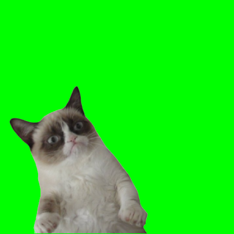

# Activité 2 : Incrustation d'une image en Python

_Comment changer l'arrière-plan d'une image ?_


Vous avez déjà vu des extraits vidéos où un acteur tourne devant un fond vert, fond vert qui sera ensuite remplacé par une autre incrusatation vidéo au montage final. 

Nous sommes maintenant capables de faire (à peu près...) la même chose avec quelques lignes de Python.

Nous travaillerons avec l'image de Grumpy Cat (image [grumpy.bmp](data/grumpy.bmp)).


{: .center}

Nous disposons aussi d'une image de même taille, [hall.png](data/hall.png), où vous reconnaîtrez le hall du lycée :

{: .center}

L'objectif est bien sûr d'intégrer Grumpy Cat dans le hall du lycée.

Le reste de l'activité se passe sur [Capytale](https://capytale2.ac-paris.fr/web/c/3577-2433749){. target="_blank"}


{#
Nous travaillerons avec trois images, représentant respectivement John Travolta (image [john.bmp](data/john.bmp)), Bernie Sanders (image [bernie.bmp](data/bernie.bmp)) et Grumpy Cat (image [grumpy.bmp](data/grumpy.bmp)).

{: .center}

{: .center}

{: .center}

Nous disposons aussi d'une image de même taille, [hall.png](data/hall.png), où vous reconnaîtrez le hall du lycée :

{: .center}

L'objectif est bien sûr d'intégrer Grumpy Cat dans le hall du lycée.

Le reste de l'activité se passe sur [Capytale](https://capytale2.ac-paris.fr/web/c-auth/list?returnto=/web/code/525f-180942).
#}
<!--
## 2. Fusion des deux images

Nous savons :
- parcourir tous les pixels d'une image (avec une double boucle)
- récupérer la valeur d'un pixel (avec ```getpixel()``` )
- modifier la valeur d'un pixel (avec ```putpixel()``` )
- faire des tests avec ```if```...

Nous avons donc tous les outils nécessaires pour accueillir John Travolta  ou Bernie Sanders dans le hall du lycée : à vos claviers !

**Correction**

```python
from PIL import Image

img_john = Image.open("john.bmp")
img_hall = Image.open("hall.png")


for x in range(400):
    for y in range(400):
        pixel = img_john.getpixel((x,y))
        if pixel != (0, 255, 0):
            img_hall.putpixel((x,y), pixel)

img_hall.show()

```


-->