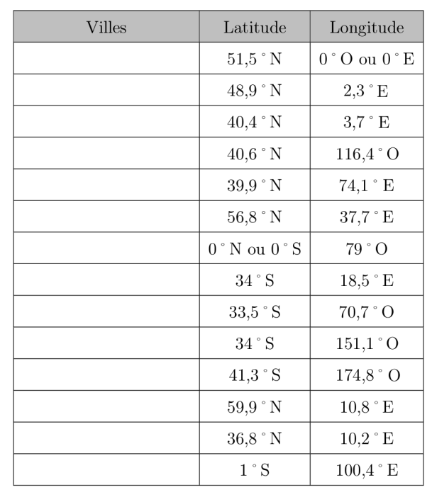
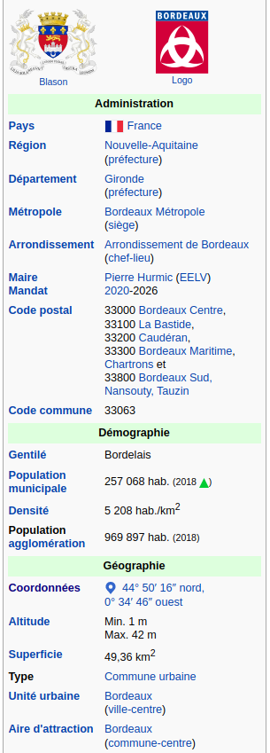

# Activité 1 : Coordonnées GPS


## 1. Se repérer à la surface de la Terre

Rendez-vous sur [ce document GeoGebra](https://www.geogebra.org/m/fd8nvqhu){:target="_blank"} et remplissez le tableau ci-dessous.

??? note "Animation GeoGebra"
    <iframe scrolling="no" title="Villes du monde" src="https://www.geogebra.org/material/iframe/id/kjhu87c3/width/1849/height/1172/border/888888/sfsb/true/smb/false/stb/false/stbh/false/ai/false/asb/false/sri/false/rc/false/ld/false/sdz/false/ctl/false" width="1849px" height="1172px" style="border:0px;"> </iframe>


{: .center width=40%}


## 2. Les différentes conventions d'écriture d'angles


{align=right}

Numériquement parlant, le format décimal (DD) des coordonnées géographiques est le plus pratique.

Sur le web (ou ailleurs), il arrive fréquemment que ces coordonnées ne soient pas données au format décimal, mais plutôt au format DMS (degré, minutes, secondes)

Il faut donc les [convertir](https://fr.wikipedia.org/wiki/Syst%C3%A8me_sexag%C3%A9simal#Conversion_de_minutes_et_secondes_en_fraction_d%C3%A9cimale_de_degr%C3%A9){:target="_blank"}.

Par exemple, les coordonnées des villes sur Wikipedia sont données au format DMS (ci-contre celles de Bordeaux).

!!! info "Conversion"
    Comme pour la mesure du temps, une minute (d'arc) correspond à 1/60 de degré et une seconde (d'arc) à 1/60 de minute, soit 1/3600 de degré.

    La latitude de Bordeaux, en décimal, est donc obtenue par le calcul:
    
    44 + 50/60 + 16/3600 = 44,837777

    Enfin, cette latitude est positive car sa position par rapport à l'équateur est Nord. Une latitude 44°50'16'' S serait donc convertie -44,837777 en décimal.

!!! warning "Point ou virgule"
    Il ne faut pas confondre notre séparateur décimal, **la virgule**, avec celui des anglo-saxons, **le point**, qui est la norme sur tout système informatique.


### 3. Utilisation du site ```coordonnnees-gps.fr```

Il existe des sites en ligne qui proposent de manipuler très facilement des coordonnées GPS, comme [https://www.coordonnees-gps.fr/](https://www.coordonnees-gps.fr/){:target="_blank"}  par exemple.


!!! example "Exercice"
    === "Énoncé"
        1. Que trouve-ton aux coordonnées : 44.83887 / -0.55537 ?
        2. Que peut-on observer aux coordonnées  : 40° 41' 21.296'' N / 74° 2' 40.199'' O ?
    === "Correction"
