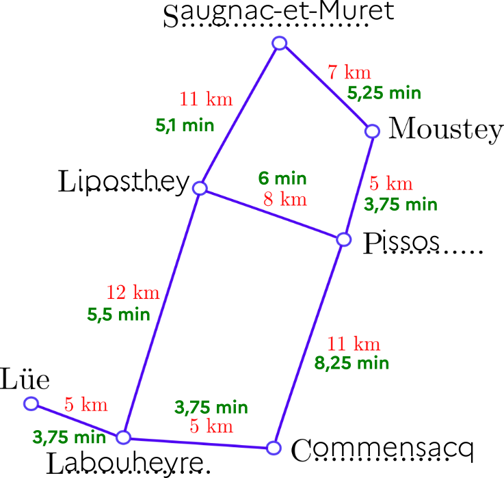
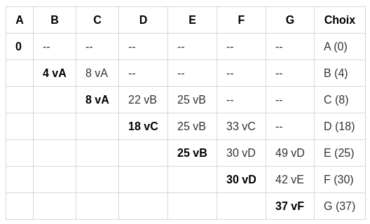

{{initexo(0)}}

# Activité 4 : itinéraires

Un automobiliste landais veut se rendre de Lüe à Moustey. Nous allons étudier les différents trajets
qu’il peut emprunter.

|  Carte | Graphe |
|:--:|:--:|
|{: .center width=100%}|{: .center width=100%}|

## 1. À la main...
### 1.1 Première métrique

1. Compléter le graphe avec les noms de villes manquants.
2. Quel est le chemin le plus court ?

### 1.2 Seconde métrique

La route entre Labouheyre et Saugnac-et-Muret est une autoroute (vitesse maximale autorisée :
130 km/h), alors que toutes les autres routes sont des routes départementales (vitesse maximale
autorisée : 80 km/h). 

1. Compléter le graphe ci-dessus en indiquant entre chaque ville le temps de parcours, si
l’automobiliste roule à la vitesse maximale autorisée.
2. Quel est le chemin le plus rapide ?

{{
correction(True,
"""
??? success \"Correction\" 
	{: .center width=50%}

	- Le chemin le plus court est : Lüe-Labouheyre-Commensacq-Pissos-Moustey (26 km)
	- Le chemin le plus rapide est : Lüe-Labouheyre-Liposthey-Pissos-Moustey (19 min)	
"""
)
}}

## 2. Via des sites de calculs d'itinéraires

1. Comparer les résultats donnés par [GeoPortail](https://www.geoportail.gouv.fr/){. target="_blank"}, [Google Maps](https://www.google.fr/maps){. target="_blank"} et [ViaMichelin](https://www.viamichelin.fr/){. target="_blank"} pour ce trajet.
2. Quels sont les critères proposés par ces sites pour optimiser le trajet ?
3. Analyser la qualité de l'interface de chacun de ces trois sites.

## 3. L'apport des mathématiques
La recherche de «meilleurs» chemins dans un graphe est un problème très actuel des mathématiques. 
Il y a des choses que l'on sait... et d'autres que l'on cherche encore !

- **Ce que l'on sait :** trouver le plus court chemin d'un point à un autre (algorithme de Dijkstra, voir plus bas)
- **Ce que l'on ne sait pas encore:** trouver (de manière rapide) le plus court chemin qui passe par tous les points d'un graphe. On appelle cela le problème du [voyageur de commerce](https://fr.wikipedia.org/wiki/Probl%C3%A8me_du_voyageur_de_commerce){. target="_blank"} et si vous le résolvez, un million de $ sont pour vous. (à moins que vous vous appeliez [Grigori Perelman](https://fr.wikipedia.org/wiki/Grigori_Perelman){. target="_blank"})

### 3.1 Comment trouver le chemin le plus court dans un graphe : algorithme de Dijkstra.
Cet algorithme (ou plutôt son optimisation A*) est utilisé par tous les logiciels de cartographie ou applications GPS pour vous indiquer le plus court chemin d'un point à un autre, en tenant compte en temps réel des conditions de parcours.

!!! abstract "{{ exercice() }}"
	
	Trouvons le plus court chemin entre le point A et le point H :
	{: .center width=60%}

	{{
	correction(True,
	"""
	??? success \"Correction\" 
		

		<iframe width='790' height='372' src='https://www.youtube.com/embed/rI-Rc7eF4iw' title='YouTube video player' frameborder='0' allow='accelerometer; autoplay; clipboard-write; encrypted-media; gyroscope; picture-in-picture' allowfullscreen></iframe>
		
		
	"""
	)
	}}

!!! abstract "{{ exercice() }}"
	Donner le plus court chemin pour aller de E à F dans le graphe ci-dessous :
	{: .center width=60%}	

	{{
	correction(True,
	"""
	??? success \"Correction\" 
		| E | A | B | C | D | F | choix |
		|:---:|:---:|:---:|:---:|:---:|:---:|:---:|
		| 0 | - | - | - | - | - | E (0)  |
		| \| | 30 vE | - | 40 vE | 10 vE | - | D (10) |
		| \| | 20 vD | - | 40 vE | \| | 80 vD | A (20) |
		| \| | \| | 60 vA | 30 vA | \| | 80 vD | C (30) |
		| \| | \| | 50 vC | \| | \| | 80 vD | B (50) |
		| \| | \| | \|    | \| | \| | 70 vB | F (70) |

		Le plus court chemin est donc E-D-A-C-B-F, qui mesure 70.
	"""
	)
	}}

!!! abstract "{{ exercice() }}"
	Donner le plus court chemin pour aller de A à G dans le graphe ci-dessous :
	{: .center width=60%}	

	{{
	correction(True,
	"""
	??? success \"Correction\" 
		{: .center width=60%}	
		Le plus court chemin est donc A-C-D-F-G, qui mesure 37.	
	"""
	)
	}}