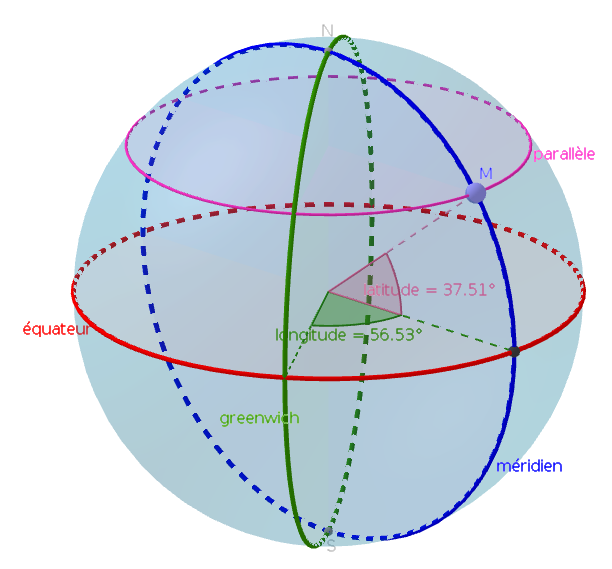
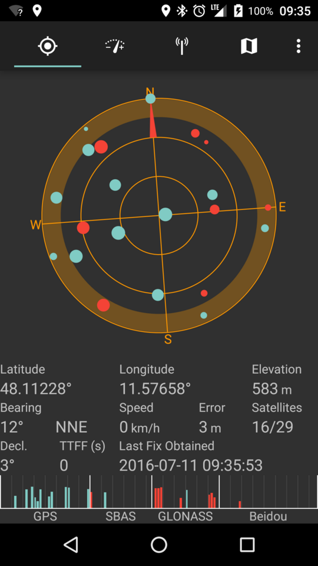
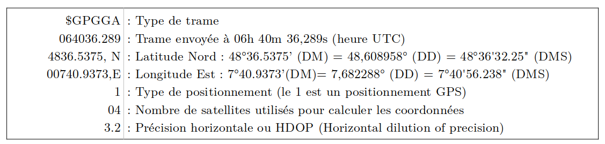

# Thème 2 : Localisation et cartographie

## 1. Coordonnées géographiques

Tout point de la Terre se situe à l'intersection de deux cercles: un **parallèle** (à l'Équateur) et un **méridien** (cercle passant par les pôles).

{: .center}


Ces cercles forment des angles par rapport au centre de la Terre : la latitude et la longitude. Ces angles sont les coordonnées géographiques (ou GPS par abus de langage) de ce point.

:arrow_right: [animation GeoGebra sur la latitude et la longitude](https://www.geogebra.org/m/qfuyanqs){. target="_blank"}

:arrow_right: [Activité 1 : villes du monde](../Activité1_GPS/){. target="_blank"}


Les angles se mesurent en degrés, soit au format décimal (avec en général au moins 6 chiffres après la virgule) ou bien en subdivisions de degrés: la minute d'arc qui vaut 1/60 de degré et la seconde d'arc qui vaut 1/60 de minute.

Pour un même lieu, il y a donc plusieurs formats d'écriture de ses coordonnées. Les deux principaux sont:

- Degrés, minutes, secondes (DMS): par exemple 45° 26' 14'' N , 12° 20' 5'' E
- Degrés décimaux (DD): par exemple 45.4372222, 12.3347222

!!! info "Quelques exemples"
	|| Paris | New-York |Rio de Janeiro| Sydney |
	|:-:|:-----:|:-----:|:-----:|:-----:|
	|DMS|48°51'24.11" N, 2°21'5.26" E| 40°42'45.2" N, 74°0'21.65" O| 22°54'39.6" O, 43°12'33.84" S | 33°51'22" S, 151°11'33" E|
	|DD| 48.856697, 2.351461| 40.704222, -74.006014|	-22.911 , -43.2094 | -33.8561, 151.1925|

On peut retrouver ces coordonnées dans l'url du site ```googlemaps``` lors d'une navigation :

{: .center}


!!! info "Conversions"
	=== "de DMS vers DD"
		Prenons par exemple la latitude de Paris. On obtient en degrés 48+51/60+24.11/3600 = 48.856697
		
		On compte positivement car la position par rapport à l'Équateur est N pour Nord (on compte négativement pour une position S pour Sud, comme Rio ou Sydney).
		
		Prenons par exemple la longitude de New-York. On obtient en degrés 74+0/60+21.65/3600 = 74.006014
		
		On compte négativement  car la position par rapport au méridien de Greenwich est O pour Ouest (on compte positivement pour une position E pour Est, comme Paris ou Sydney).
		
	=== "de DD vers DMS"
	
		Prenons par exemple la latitude de Rio de Janeiro : -22.911
		
		- Le signe moins indique que la position est S
		- La partie entière donne les degrés (22)
		- On multiplie la partie décimale par 60 : 0.911x60=54.66 dont la partie entière donne les minutes (54)
		- On recommence avec la partie décimale du précédent pour obtenir les secondes : 0.66x60=39.6
		
		On obtient donc en DMS 22°54'39.6" S.

<!--	=== "Avec Python"-->
<!--		On peut créer des fonctions pour automatiser ces calculs:-->
<!--		-->

## 2. GPS

### 2.1 Fonctionnement
<p style="text-align: center;">

<iframe width="560" height="315" src="https://www.youtube.com/embed/iTfNhcC2vBA?rel=0" title="YouTube video player" frameborder="0" allow="accelerometer; autoplay; clipboard-write; encrypted-media; gyroscope; picture-in-picture" allowfullscreen></iframe>

<iframe width="560" height="315" src="https://www.youtube.com/embed/e79tSIpLiDk?rel=0" title="YouTube video player" frameborder="0" allow="accelerometer; autoplay; clipboard-write; encrypted-media; gyroscope; picture-in-picture" allowfullscreen></iframe>
</p>


### 2.2 Questions

!!! example "Exercice"
	=== "Fonctionnement du GPS"
		1. Pour indiquer sa position à l’utilisateur, un smartphone envoie-t-il une demande au réseau, à un central, à un satellite ou plusieurs ? (attention il y a un piège)

		2. Que reçoit-il d’un satellite ?

		3. Comment calcule-t-il sa distance avec un satellite ? 

		4. Quel matériel embarqué sur le satellite assure la précision ? 

		5. Où sont situés, géométriquement, tout les points à la même distance d’un satellite ? 

		6. Quelle est l’intersection de deux sphères ? De trois sphères ?

		7. Combien de satellites au minimum le smartphone doit-il capter ?

		8. Quel est le rôle du dernier satellite nécessaire ?

	=== "Réponses"
		1. Un smartphone **n'envoie rien**. Il ne fait que recevoir des signaux.
		2. Il reçoit d'un satellite un message contenant la position du satellite et l'heure d'envoi du message. 
		3. En mesurant le temps mis par le message à parvenir jusqu'à lui, le récepteur GPS calcule la distance qui les sépare (grâce à la formule $d = V \times t$)
		4. Une horloge atomique assure la précision de l'heure à bord du satellite.
		5. Tous les points à la même distance d'un satellite sont situés une sphère.
		6. L'intersection de deux sphères est un cercle. L'intersection de trois sphères est 2 points.
		7. Le smartphone doit capter au minimum 4 satellites.
		8. Le 4ème satellite sert à prendre en compte le décalage de l'horloge du smartphone par rapport à celle des satellites. 


Intersection de 3 sphères :
{: .center width=40%}


!!! example "Exercice de calcul de distance"
	=== "Énoncé"
		Supposons que le signal d'un satellite S ait mis 0,071 secondes à me parvenir.  
		À quelle distance du satellite S suis-je ?  
		*On considèrera que le signal envoyé par le satellite a une vitesse de 300 000 km/s*

	=== "Correction"
		$300000 \times 0,071 = 21300$  

		Le satellite est à 21300 km au dessus de moi.


??? tip "Application smartphone"
	L'application Satstat permet de repérer les satellites en communication avec le smartphone et d'obtenir des informations complètes de localisation.

	{: .center} 

!!! example "Exercice d'analyse critique d'une vidéo"
	<center>
	<video controls>
		<source src="https://glassus.github.io/snt/Theme2_Localisation_Cartographie/data/car.mp4" type="video/mp4">
	</video>
	</center>
	Cette vidéo, postée fin novembre 2022 sur les réseaux sociaux, est rapidement devenue virale. Pourtant, son authenticité semble très douteuse. Pourquoi ?


### 2.3 De la puce GPS aux applications du téléphone : la trame NMEA


{: .center width=20%}

La puce GPS ci-dessus (puce d'une iPhone 6) possède les capacités de calcul (dans son microprocesseur) pour déterminer elle-même les coordonnées GPS. Mais il faut ensuite transmettre ces coordonnées à la puce centrale du téléphone (qui est en fait un véritable ordinateur, muni d'un système d'exploitation).  
Ainsi toutes les applications ayant recours à la géolocalisation (et elles sont nombreuses) vont «demander» les coordonnées GPS à la puce dédiée qui va les leur fournir en envoyant une **trame** : la [trame NMEA 0183](https://fr.wikipedia.org/wiki/NMEA_0183){:target="_blank"}.


{: .center} 
{: .center }


??? tip "Application smartphone"
	L'application **NMEA Tools** permet d'enregistrer et de sauvegarder des trames NMEA. Important pour récupérer la trace d'un trajet effectué.

	{: .center  width=100%} 


??? tip "Extrait d'un flot de transmission de trames NMEA"
	``` hl_lines="1 12 24"
	$GPGGA,082948.0,,,,,0,,,,,,,,*77
	$GPVTG,,T,,M,,N,,K,N*2C
	$GPRMC,,V,,,,,,,,,,N*53
	$GPGSA,A,1,,,,,,,,,,,,,,,*1E
	$GNGSA,A,1,,,,,,,,,,,,,,,*00
	$GPGSV,3,1,10,12,36,213,33,13,34,135,26,15,64,172,25,24,66,303,14*7C
	$GPGSV,3,2,10,25,02,222,13,10,21,306,,17,30,070,,19,30,099,*72
	$GPGSV,3,3,10,20,24,275,,28,11,043,*71
	$GLGSV,3,1,09,67,25,180,25,68,63,246,12,78,68,323,,86,12,022,*60
	$GLGSV,3,2,09,77,34,046,,79,27,258,,69,33,322,,88,04,122,*65
	$GLGSV,3,3,09,87,18,080,*52
	$GPGGA,082949.0,4445.565178,N,00037.248152,W,1,04,1.9,34.7,M,50.0,M,,*7C
	$GPVTG,,T,,M,,N,,K,N*2C
	$GPRMC,082949.0,A,4445.565178,N,00037.248152,W,,,300419,0.0,E,A*13
	$GPGSA,A,2,12,13,15,24,,,,,,,,,2.1,1.9,1.0*3A
	$GNGSA,A,2,12,13,15,24,,,,,,,,,2.1,1.9,1.0*24
	$GNGSA,A,2,67,68,,,,,,,,,,,2.1,1.9,1.0*28
	$GPGSV,3,1,10,12,36,213,31,13,34,135,27,15,64,172,25,24,66,303,14*7F
	$GPGSV,3,2,10,25,02,222,13,10,21,306,,17,30,070,,19,30,099,*72
	$GPGSV,3,3,10,20,24,275,,28,11,043,*71
	$GLGSV,3,1,09,67,25,180,23,68,63,246,12,78,68,323,,86,12,022,*66
	$GLGSV,3,2,09,77,34,046,,79,27,258,,69,33,322,,88,04,122,*65
	$GLGSV,3,3,09,87,18,080,*52
	$GPGGA,082950.0,4445.563885,N,00037.249286,W,1,04,1.9,43.7,M,50.0,M,,*72
	```

	Il nous faut observer les trames **GPPGA** :

	- la trame 1 est incomplète : la puce n'a pas encore reçu assez de messages des satellites pour commencer ses calculs.
	- les trames 12 et 24 sont complètes : on peut y lire les coordonnées GPS.


??? abstract "Activité 1 : coordonnées GPS"
	voir [ici](../../Theme2_Localisation_Cartographie/Activité1_GPS/)


<!-- ??? abstract "Correction DS GPS"
	voir [ici](../../Theme2_Localisation_Cartographie/data/SNT_eval_GPS_corr.pdf)
 -->

??? abstract "Activité 2 : métadonnées EXIF"
	voir [ici](../../Theme2_Localisation_Cartographie/Activité2_Exif/)


## 3. Services de cartographie

**Géoportail**  est  un  site  public  français permettant l’accès à  des  données  géographiques  ou  géolocalisées. L’utilisateur peut superposer sur un fond de carte (carte de l’Institut national de l’information géographique et forestière, photographie aérienne, carte du relief) différents couches de données(carte des transports, emplacement  des hôpitaux,  départements,  etc...) de  manière  à  créer  une  carte  numérique  personnalisée. Géoportail permet aussi la localisation, le calcul de distances, de surfaces et d’itinéraires.

**OpenStreetMap**  est un service  de  cartographie  libre  et  collaboratif  qui  permet  de visualiser, de modifier et d’utiliser des données géographiques. Il propose également le calcul  d’itinéraire.  Chacun  peut  contribuer  à OpenStreetaMap  en ajoutant  des informations manquantes on en corrigeant des erreurs.

??? abstract "Activité 3 : GéoPortail"
	voir [ici](../../Theme2_Localisation_Cartographie/Activité3_GeoPortail/)


### 3.1 Optimisation d'itinéraire
Un automobiliste landais veut se rendre de Lüe à Moustey. Nous allons étudier les différents trajets
qu’il peut emprunter.

|  Carte | Graphe |
|:--:|:--:|
|{: .center width=60%}|{: .center width=60%}|

### 3.1.1 Première métrique

1. Compléter le graphe avec les noms de villes manquants.
2. Quel est le chemin le plus court ?

### 3.1.2 Seconde métrique

La route entre Labouheyre et Saugnac-et-Muret est une autoroute (vitesse maximale autorisée :
130 km/h), alors que toutes les autres routes sont des routes départementales (vitesse maximale
autorisée : 80 km/h). 

1. Compléter le graphe ci-dessus en indiquant entre chaque ville le temps de parcours, si
l’automobiliste roule à la vitesse maximale autorisée.
2. Quel est le chemin le plus rapide ?

### 3.1.3 Les parcours sur un graphe
La recherche de «meilleurs» chemins dans un graphe est un problème très actuel des mathématiques. 
Il y a des choses que l'on sait... et d'autres que l'on cherche encore !

- **Ce que l'on sait :** trouver le plus court chemin d'un point à un autre (algorithme de Dijkstra, voir plus bas)
- **Ce que l'on ne sait pas encore:** trouver (de manière rapide) le plus court chemin qui passe par tous les points d'un graphe. On appelle cela le problème du [voyageur de commerce](https://fr.wikipedia.org/wiki/Probl%C3%A8me_du_voyageur_de_commerce){.target="_blank"}.  
Si vous le résolvez, un million de $ sont pour vous (et je pense que vous irez les chercher, pas comme [Grigori Perelman](https://fr.wikipedia.org/wiki/Grigori_Perelman){.target="_blank"})


### 3.1.3 Comment trouver le chemin le plus court dans un graphe : algorithme de Dijkstra.
Cet algorithme (ou plutôt son optimisation A*) est utilisé par tous les logiciels de cartographie ou applications GPS pour vous indiquer le plus court chemin d'un point à un autre, en tenant compte en temps réel des conditions de parcours.


!!! example "Exemple"
	Trouvons le plus court chemin entre le point A et le point H :
	{: .center width=60%}

	??? tip "Correction vidéo"
		<p align="center">
		<iframe width="790" height="372" src="https://www.youtube.com/embed/rI-Rc7eF4iw" title="YouTube video player" frameborder="0" allow="accelerometer; autoplay; clipboard-write; encrypted-media; gyroscope; picture-in-picture" allowfullscreen></iframe>
		</p>


!!! example "Exercice"
    === "Énoncé"
        Donner le plus court chemin pour aller de E à F dans le graphe ci-dessous :
        {: .center width=60%}


!!! example "Exercice"
    === "Énoncé"
        Donner le plus court chemin pour aller de A à G dans le graphe ci-dessous :
        {: .center width=60%}

	=== "Correction"
		{: .center width=60%}