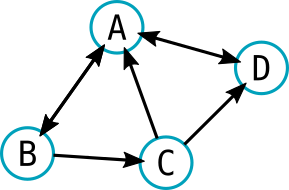

# Activité 2 : Réseaux sociaux et graphes

## 1. Modéliser les relations par un graphe

Sur les réseaux sociaux, certaines relations sont symétriques («être amis» sur Facebook) ou aysmétriques («être un follower» sur Twitter).

**Exercice :** Classifiez les réseaux sociaux que vous connaissez en *symétriques* ou *asymétriques*.

### 1.1 Facebook : graphe non orienté

{: .center width=30%}

### 1.2 Twitter : graphe orienté

{: .center width=30%}

Un graphe réel peut donner des choses [comme ceci](https://github.com/eleurent/twitter-graph/blob/master/examples/friends/friends_label_1080p.jpg){target = "_blank"}
 
## 2. Pourquoi j'ai moins d'amis que mes amis ?

Basé sur la vidéo de Mickaël Launay : 

<iframe width="933" height="525" src="https://www.youtube.com/embed/MySkCFFgiRQ" title="YouTube video player" frameborder="0" allow="accelerometer; autoplay; clipboard-write; encrypted-media; gyroscope; picture-in-picture" allowfullscreen></iframe>

Soit un ensemble d'amis connectés sur un réseau social quelconque. Voici les interactions qu'on a recensées :

- André est ami avec Béa, Charles, Estelle et Fabrice,
- Béa est amie avec André, Charles, Denise et Héloïse,
- Charles est ami avec André, Béa, Denise, Estelle, Fabrice et Gilbert,
- Denise est amie avec Béa, Charles et Estelle,
- Estelle est amie avec André, Charles et Denise,
- Fabrice est ami avec André, Charles et Gilbert,
- Gilbert est ami avec Charles et Fabrice,
- Héloïse est amie avec Béa.

**Questions**

{{
correction(False,
"""
??? success \"Correction\" 
    {: .center}    
"""
)
}}

 
1. Dessinez le graphe de ce réseau social.  
2. Écrivez à coté de chaque nœud le nombre d'amis de chacun. 
3. Calculez la moyenne du nombre d'amis dans la totalité de ce réseau social.
4. Calculez le pourcentage de personnes qui ont un nombre d'amis **inférieur ou égal au nombre moyen d'amis de ce réseau.**
4. Calculez pour chacun personne, la *moyenne du nombre d'amis de leurs amis*.  
Par exemple : Gilbert ne voit pas tout le graphe, il ne perçoit que Fabrice (3 amis) et Charles (6 amis).  
La moyenne des amis de ses amis est de $\frac{3+6}{2}=4,5$ amis.  
Notez cette moyenne d'une couleur différente.
4. Calculez le pourcentage de personnes qui ont un nombre d'amis **inférieur ou égal au nombre moyen d'amis de leurs amis.**
5. Que constate-t-on ?

