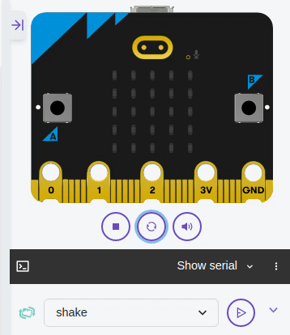

# Objets connectés

{{initexo(0)}}

## 0. Présentation de la carte BBC micro:bit

**BBC micro:bit** est une carte à [microcontrôleur](https://fr.wikipedia.org/wiki/Microcontr%C3%B4leur){. target="_blank"} conçue en 2015 au Royaume-Uni pour développer l'apprentissage de l'algorithmique et de la programmation.

{: .center}


La carte micro:bit dispose des [spécificités techniques](https://microbit.org/fr/guide/features/){. target="_blank"}  suivantes :

- 25 LEDs programmables individuellement
- 2 boutons programmables
- Broches de connexion
- Capteurs de lumière et de température
- Capteurs de mouvements (accéléromètre et boussole)
- Communication sans fil, via Radio et Bluetooth
- Interface USB

## 1. "Hello world !", virtuellement ou IRL...

### 1.1 À distance ? Pas de micro:bit ? le simulateur est là !

Rendez-vous sur la page [https://python.microbit.org/v/3](https://python.microbit.org/v/3){. target="_blank"}


Cliquez sur le bouton Play de la micro:bit virtuelle. C'est parti !


Pour éviter des erreurs, fermez la fenêtre de droite (le simulateur) à chaque fois que vous modifiez votre code de la partie gauche.

### 1.2 Avec une micro:bit réelle

La manipulation suivante ne marche que sur le navigateur Google Chrome.

1. Branchez la carte sur un port USB. Un lecteur MICROBIT apparait dans les périphériques USB.
2. Rendez-vous sur l'adresse [https://python.microbit.org/v/3](https://python.microbit.org/v/3){. target="_blank"}
3. Modifiez le code présent puis cliquez sur le bouton Play de la micro:bit virtuelle.
4. Cliquer sur le bouton violet «Send to micro:bit». 


Cette procédure est à répéter à chaque nouveau code.

## 2. Découverte des fonctionnalités

### 2.1 Explication du code par défaut

!!! abstract "code par défaut du simulateur"
    ```python linenums='1'
    # Imports go at the top
    from microbit import *

    # Code in a 'while True:' loop repeats forever
    while True:
        display.show(Image.HEART)
        sleep(1000)
        display.scroll('Hello')
    ```

- Les lignes précédées de # sont des commentaires : elles ne servent qu'à expliquer le code, on peut les enlever.
- ```from microbit import *``` est une ligne qui devra toujours être au début du code : elle sert à importer des fonctions spécifiques à la micro:bit
- ```while True:``` est ce qu'on appelle une *boucle infinie*. Tout ce qui est sous ce code (indenté) sera répété infiniment.
- ```display.show(Image.HEART)``` permet d'afficher l'image (ou plutôt les pixels...) qui forment un cœur.
- ```sleep(1000)``` permet de mettre en pause le programme pendant 1000 millisecondes, donc 1 seconde.
- ```display.scroll('Hello')``` permet de faire défiler le texte ```Hello```.    


!!! example "{{ exercice() }}"
    Modifier le code précédent pour que la carte affiche alternativement un cœur et un parapluie (*umbrella* en anglais)


    ??? note "Liste des images disponibles"
        ```
        Image.HEART
        Image.HEART_SMALL
        Image.HAPPY
        Image.SMILE
        Image.SAD
        Image.CONFUSED
        Image.ANGRY
        Image.ASLEEP
        Image.SURPRISED
        Image.SILLY
        Image.FABULOUS
        Image.MEH
        Image.YES
        Image.NO
        Image.CLOCK12
        Image.CLOCK11
        Image.CLOCK10
        Image.CLOCK9
        Image.CLOCK8
        Image.CLOCK7
        Image.CLOCK6
        Image.CLOCK5
        Image.CLOCK4
        Image.CLOCK3
        Image.CLOCK2
        Image.CLOCK1
        Image.ARROW_N
        Image.ARROW_NE
        Image.ARROW_E
        Image.ARROW_SE
        Image.ARROW_S
        Image.ARROW_SW
        Image.ARROW_W
        Image.ARROW_NW
        Image.TRIANGLE
        Image.TRIANGLE_LEFT
        Image.CHESSBOARD
        Image.DIAMOND
        Image.DIAMOND_SMALL
        Image.SQUARE
        Image.SQUARE_SMALL
        Image.RABBIT
        Image.COW
        Image.MUSIC_CROTCHET
        Image.MUSIC_QUAVER
        Image.MUSIC_QUAVERS
        Image.PITCHFORK
        Image.XMAS
        Image.PACMAN
        Image.TARGET
        Image.TSHIRT
        Image.ROLLERSKATE
        Image.DUCK
        Image.HOUSE
        Image.TORTOISE
        Image.BUTTERFLY
        Image.STICKFIGURE
        Image.GHOST
        Image.SWORD
        Image.GIRAFFE
        Image.SKULL
        Image.UMBRELLA
        Image.SNAKE
        ``` 

    {{
    correction(False,
    """
    ??? success \"Correction\" 
        ```python linenums='1'
        from microbit import *

        while True:
            display.show(Image.HEART)
            sleep(1000)
            display.show(Image.UMBRELLA)
            sleep(1000)
        ```
    """
    )
    }}

#### Créer sa propre image
Chaque pixel LED sur l’affichage physique peut prendre une parmi dix valeurs. Si un pixel prend la valeur 0 c’est qu’il est éteint. Littéralement, il a une luminosité de zéro. En revanche, s’il prend la valeur 9 il est à la luminosité maximale. Les valeurs de 1 à 8 représentent des niveaux de luminosité entre éteint (0) et « au maximum » (9).


```python
from microbit import *

bateau = Image("05050:"
               "05050:"
               "05050:"
               "99999:"
               "09990")

display.show(bateau)
```

Comment dessiner une image? Chaque ligne de l’affichage physique est représentée par une ligne de nombres se terminant par `:` et entourée de guillemets doubles `"`. Chaque nombre indique une luminosité. Il y a cinq lignes de cinq nombres donc il est possible de spécifier la luminosité individuelle de chacune des cinq LED sur chacune des cinq lignes sur l’affichage physique. C’est ainsi que l'on crée une image.

!!! example "{{ exercice() }}"
    Créer une image de pierre, de feuille et de ciseaux. Ces images seront à sauvegarder dans un fichier Python afin que nous puissions nous en resservir dans un autre exercice.


### 2.1.3 Les pixels (`display.set_pixel(x, y, val)`)
Vous pouvez régler la luminosité des pixels de l'affichage individuellement de 0 (désactivé) à 9 (luminosité maximale). Pour des informations sur les coordonnées de l'affichage, voir le [guide pour matrice à LED](https://microbit.org/guide/hardware/leds/){. target="_blank"}.

Exécuter le programme suivant:


```python
from microbit import *
display.set_pixel(1, 4, 9)
```

!!! example "{{ exercice() }}"
    Faire clignoter un pixel.

    {{
    correction(False,
    """
    ??? success \"Correction\" 
        ```python linenums='1'
        from microbit import *

        display.set_pixel(1, 4, 9)
        sleep(200)
        display.set_pixel(1, 4, 0)
        sleep(200)
        ```    
    """
    )
    }}


#### Avec un peu d'aléatoire  (voir [documentation sur le hasard](https://microbit-micropython.readthedocs.io/fr/latest/tutorials/random.html){. target="_blank"})
Dans le programme suivant que vous exécuterez, on importe `randint` du module `random` de MicroPython et on l'utilise pour afficher un pixel au hasard sur la matrice.

L'instruction ```randint(0,4)``` va renvoyer un nombre (pseudo-)aléatoire entre 0 et 4 inclus. 

```python
from microbit import *
from random import randint

x = randint(0,4)
y = randint(0,4)
display.set_pixel(x, y, 9)
```

Tester le programme précédent plusieurs fois de suite. Pour cela, redémarrer la micro:bit en appuyant sur le bouton `RESET` situé à l'arrière de la carte.


### 2.3 Boucle `for`

Le programme suivant utilise une boucle `for` pour faire défiler un pixel sur une ligne.

Grâce à l'expression ```for i in range(5):```, la variable ```i``` va prendre successivement les valeurs ```0```,  ```1```, ```2```, ```3``` et ```4```. (pas ```5``` !) 


```python
from microbit import *
while True:
    for i in range(5):
        display.set_pixel(i,0,9)
        sleep(200)
        display.clear()
```


!!! example "{{ exercice() }}"
    Faire «pulser» le pixel central en augmentant progressivement sa luminosité, de 0 à 9.

    {{
    correction(False,
    """
    ??? success \"Correction\" 
        ```python linenums='1'
        from microbit import *

        while True:
            for i in range(10):
                display.set_pixel(2, 2, i)
                sleep(100)
        ```
    """
    )
    }}

!!! example "{{ exercice() }}"
    Même exercice mais en augmentant puis en diminuant progressivement sa luminosité.

    {{
    correction(False,
    """
    ??? success \"Correction\" 
        ```python linenums='1'
        from microbit import *

        while True:
            for i in range(10):
                display.set_pixel(2, 2, i)
                sleep(100)
            for i in range(10):
                display.set_pixel(2, 2, 9-i)
                sleep(100)
        ```
    """
    )
    }}


### 2.4 Les entrées boutons A, B et A+B - programmation événementielle [(vidéo explicative)](https://youtu.be/t_Qujjd_38o){. target="_blank"}

{: .center width=30%}


 Il y a deux boutons sur la face avant du micro:bit (étiquetés A et B). On peut détecter quand ces boutons sont pressés, ce qui permet de déclencher des instructions sur l'appareil.

Exemples avec le boutton A:

- `button_a.is_pressed()`: renvoie *True* si le bouton spécifié est actuellement enfoncé et *False* sinon.
- `button_a.was_pressed()`: renvoie *True* ou *False* pour indiquer si le bouton a été appuyé depuis le démarrage de l'appareil ou la dernière fois que cette méthode a été appelée. **C'est cette instruction que nous allons utiliser.**

**Exemple :** Essayer le programme suivant qui fait défiler le texte "SNT" indéfiniment. On introduit l'**instruction conditionnelle** `if` qui va tester si le bouton A a été pressé (pendant le défilement du texte ou pendant la pause), auquel cas le programme s'arrête en exécutant la commande `break`.


```python
from microbit import *
while True:
    display.scroll("SNT")
    if button_a.was_pressed():
        break
display.clear()
display.show(Image.SAD)
```

!!! example "{{ exercice() }}"

    === "Énoncé"
        Créer le code permettant de basculer d'un visage triste à un visage heureux suivant qu'on appuie sur A ou sur B. 

        {: .center}

    === "Aide"
        ```python
        from microbit import *
        while True:
            if ...:
                ...
            if ...:
                ...
        ```      

    
    {{
    correction(False,
    """
    ??? success \"Correction\" 
        ```python
        from microbit import *
        while True:
            if button_a.was_pressed():
                display.show(Image.SAD)
            if button_b.was_pressed():
                display.show(Image.HAPPY)
        ```

        Pour rajouter la gestion des 2 boutons simultanés:
        ```python
        from microbit import *
        while True:
            if button_a.was_pressed():
                display.show(Image.SAD)
            if button_b.was_pressed():
                display.show(Image.HAPPY)
            if button_a.is_pressed() and button_b.is_pressed():
                display.show(Image.RABBIT)
        ```           
    """
    )
    }}


#### 2.5 Détection du mouvement de la carte : vers le Pierre-Feuille-Ciseaux

Observer et exécuter le code suivant :

```python linenums='1'
from microbit import *

display.show(Image.SAD)
while True:
    if accelerometer.was_gesture('shake'):
        display.show(Image.HAPPY)
```

Nous sommes donc maintenant prêts à faire un Pierre-Feuille-Ciseaux qui se déclenchera lors du secouage de la carte.


!!! example "{{ exercice() }}"
    
    === "Énoncé"
        Créer un jeu de Pierre-Feuille-Ciseaux qui se déclenchera lorsqu'on secoue la Microbit. 

        {: .center}

        La détection du "secouage" de la carte se fera avec l'instruction suivante :
        ```python
        if accelerometer.was_gesture('shake'):
            ...
        ```
    
    === "Aide"
        ```python linenums='1'
        from microbit import *
        from random import randint

        pierre = Image(...)

        feuille = Image(...)

        ciseaux = Image(...)


        while True:
            if accelerometer.was_gesture('shake'):
                v = ...
                if v == ...:
                    display.show(...)
                if v == ...:
                    display.show(...)
                if v == ...:
                    display.show(...)
        ```
        Images :
        ```python linenums='1'
        pierre = Image('09990:'
                       '09009:'
                       '09990:'
                       '09000:'
                       '09000')

        feuille = Image('09999:'
                       '09000:'
                       '09990:'
                       '09000:'
                       '09000')

        ciseaux = Image('00999:'
                       '09000:'
                       '09000:'
                       '09000:'
                       '00999')
        ```
    
    {{
    correction(False,
    """
    ??? success \"Correction\" 
        ```python linenums='1'
        from microbit import *
        from random import randint

        pierre = Image('09990:'
                       '09009:'
                       '09990:'
                       '09000:'
                       '09000')

        feuille = Image('09999:'
                       '09000:'
                       '09990:'
                       '09000:'
                       '09000')

        ciseaux = Image('00999:'
                       '09000:'
                       '09000:'
                       '09000:'
                       '00999')


        while True:
            if accelerometer.was_gesture('shake'):
                v = randint(1,3)
                if v == 1:
                    display.show(pierre)
                if v == 2:
                    display.show(feuille)
                if v == 3:
                    display.show(ciseaux)
        ```        
    """
    )
    }}

!!! example "{{ exercice() }}"
    === "Énoncé"
        On veut créer le code permettant de déplacer un point vers la gauche ou vers la droite en appuyant sur A ou sur B.

        {: .center}

    === "Aide"
        ```python linenums='1'
        from microbit import *
        x = ...
        while True:
            display.clear()
            display.set_pixel(...)
            if button_a.was_pressed():
                x = ...
            if button_b.was_pressed():
                x = ...
        ```


    {{
    correction(False,
    """
    ??? success \"Correction\" 
        ```python linenums='1'
        from microbit import *
        x = 2
        while True:
            display.clear()
            display.set_pixel(x, 2, 9)
            if button_a.was_pressed():
                x = x - 1
            if button_b.was_pressed():
                x = x + 1
        ```        
    """
    )
    }}


!!! example "{{ exercice() }}"
    
    === "Énoncé"
        Même chose mais en faisant parcourir tout l'écran au pixel :

        - si on sort à droite, on se décale d'une ligne vers le bas et on revient tout à gauche.
        - si on sort à gauche, on se décale d'une ligne vers le haut et on revient tout à droite.


    === "Aide"
        ```python linenums='1'
        from microbit import *
        x = 2
        y = 2
        while True:
            display.clear()
            display.set_pixel(x, y, 9)
            if button_a.was_pressed():
                x = ...
            if button_b.was_pressed():
                x = ...
            if x == 5:
                x = ...
                y = ...
            if x == -1:
                x = ...
                y = ...
            if y == 5:
                x = ...
                y = ...
            if y == -1:
                x = ...
                y = ...       
        ```

    {{
    correction(False,
    """
    ??? success \"Correction\" 
        ```python linenums='1'
        from microbit import *
        x = 2
        y = 2
        while True:
            display.clear()
            display.set_pixel(x, y, 9)
            if button_a.was_pressed():
                x = x - 1
            if button_b.was_pressed():
                x = x + 1
            if x == 5:
                x = 0
                y = y + 1
            if x == -1:
                x = 4
                y = y - 1
            if y == 5:
                x = 0
                y = 0
            if y == -1:
                x = 4
                y = 4       
        ```        
    """
    )
    }}


!!! example "{{ exercice() }} : un jeu !"
    
    === "Énoncé"
        On veut créer le jeu suivant :
        
        - au démarrage, un pixel aléatoire est placé sur l'écran : c'est la cible à atteindre.
        - il faut ensuite se déplacer un point vers la gauche ou vers la droite en appuyant sur A ou sur B.
        - lorsque qu'on a rejoint la cible, un emoji HAPPY apparait.

        {: .center}

    === "Aide"
        ```python linenums='1'
        from microbit import *
        from random import randint

        # choix des coordonnées aléatoires du point à rejoindre
        n = ...
        p = ...

        # point de départ de notre pixel mobile
        x = ...
        y = ...

        while True:
            display.clear()

            # affichage des deux pixels
            display.set_pixel(...)
            display.set_pixel(...)

            # mouvement de notre pixel mobile 
            ...


            # test pour savoir si notre pixel mobile a rejoint la cible
            if ... and ...:
              ...  # affichage de l'image HAPPY
              ...  # sortie de la boucle
            
        
        ```

    
    {{
    correction(False,
    """
    ??? success \"Correction\" 
        ```python linenums='1'
        from microbit import *
        from random import randint

        n = randint(0,4)
        p = randint(0,4)

        x = 2
        y = 2

        while True:
            display.clear()
            display.set_pixel(n, p, 9)
            display.set_pixel(x, y, 9)

            if button_a.was_pressed():
                x = x - 1

            if button_b.was_pressed():
                x = x + 1

            if x == 5:
                x = 0
                y = y + 1

            if x == -1:
                x = 4
                y = y - 1

            if y == 5:
                y = 0

            if y == -1:
                y = 4

            if x == n and y == p:
              display.show(Image.HAPPY)  
              break

        
        ```        
    """
    )
    }}


:arrow_right: **Gestion du temps**

La fonction ```tick_ms``` du module ```utime``` renvoie le nombre de millisecondes écoulées depuis le démarrage de la carte. Pour mesurer le temps écoulé dans un programme, on fixe le temps du début du programme dans une variable ```t0```. Il suffit d'observer ensuite la valeur de ```tick_ms() - t0``` pour savoir combien de temps (en millisecondes) s'est écoulé depuis le début du programme.

Exemple (à exécuter pour comprendre !) :
```python linenums='1'
from microbit import *
from utime import *

display.show(Image.HAPPY)
t0 = ticks_ms()

while True:
    if ticks_ms() - t0 > 3000:
        display.show(Image.SAD)
        break
```


!!! example "{{ exercice() }}"
    
    Reprendre l'exercice précédent, en rajoutant un temps limité : il faut rattraper le pixel avant que le temps soit écoulé. 

    {{
    correction(False,
    """
    ??? success \"Correction\" 
        ```python linenums='1'
        from microbit import *
        from random import randint
        from utime import *

        n = randint(0,4)
        p = randint(0,4)

        x = 2
        y = 2

        t0 = ticks_ms()

        while True:
            if ticks_ms() - t0 > 5000:
                display.show(Image.SAD)
                break

            display.clear()
            display.set_pixel(n, p, 9)
            display.set_pixel(x, y, 9)

            if button_a.was_pressed():
                x = x - 1

            if button_b.was_pressed():
                x = x + 1

            if x == 5:
                x = 0
                y = y + 1

            if x == -1:
                x = 4
                y = y - 1

            if y == 5:
                y = 0

            if y == -1:
                y = 4

            if x == n and y == p:
              display.show(Image.HAPPY)
              break


        ```         
    """
    )
    }}

 

{#
!!! example "Exercice 5"
    === "Énoncé"
        Créer le code permettant de faire défiler toutes les images disponibles. 
        Bouton B pour passer à l'image suivante, bouton A pour revenir à l'image précédente.

        {: .center}

        {#
        Compléter le code proposé :


        ```python
        from microbit import *

        lst = [Image.HEART, Image.HEART_SMALL, Image.HAPPY, Image.SMILE,
               Image.SAD, Image.CONFUSED, Image.ANGRY, Image.ASLEEP, Image.SURPRISED, Image.SILLY,
               Image.FABULOUS, Image.MEH, Image.YES, Image.NO, Image.CLOCK12,
               Image.CLOCK11, Image.CLOCK10, Image.CLOCK9, Image.CLOCK8, Image.CLOCK7,
               Image.CLOCK6, Image.CLOCK5, Image.CLOCK4, Image.CLOCK3, Image.CLOCK2,
               Image.CLOCK1, Image.ARROW_N, Image.ARROW_NE, Image.ARROW_E, Image.ARROW_SE,
               Image.ARROW_S, Image.ARROW_SW, Image.ARROW_W, Image.ARROW_NW, Image.TRIANGLE,
               Image.TRIANGLE_LEFT, Image.CHESSBOARD, Image.DIAMOND, Image.DIAMOND_SMALL, Image.SQUARE,
               Image.SQUARE_SMALL, Image.RABBIT, Image.COW, Image.MUSIC_CROTCHET, Image.MUSIC_QUAVER,
               Image.MUSIC_QUAVERS, Image.PITCHFORK, Image.XMAS, Image.PACMAN, Image.TARGET, Image.TSHIRT,
               Image.ROLLERSKATE, Image.DUCK, Image.HOUSE, Image.TORTOISE, Image.BUTTERFLY, Image.STICKFIGURE,
               Image.GHOST, Image.SWORD, Image.GIRAFFE, Image.SKULL, Image.UMBRELLA, Image.SNAKE]

        ```
        #}


    
{#
:warning: fin du programme de révision pour l'évaluation finale Moodle :warning:
---------

### 2.5 Capteur de lumière [(vidéo)](https://youtu.be/TKhCr-dQMBY){. target="_blank"}

En inversant les LEDs d'un écran pour devenir un point d'entrée, l'écran LED devient un capteur de lumière basique, permettant de détecter la luminosité ambiante.

La commande `display.read_light_level()` retourne un entier compris entre 0 et 255 représentant le niveau de lumière.

**Exercice :** Compléter le programme ci-dessous qui affiche une image de lune si on baisse la luminosité (en recouvrant la carte avec sa main par exemple) et un soleil sinon.


```python

from microbit import *

soleil = Image("90909:"
               "09990:"
               "99999:"
               "09990:"
               "90909:")

lune = Image("00999:"
             "09990:"
             "09900:"
             "09990:"
             "00999:")

while True:
    if display.read_light_level()> ... : #trouver la bonne valeur (entre 0 et 255)
        display.show(soleil)
    else:
        display.show(...) #trouver la bonne variable
    sleep(10)
```

**Prolongement:** créer un programme qui affiche le niveau de luminosité et le tester avec la LED d'un téléphone portable ou une lampe-torche par exemple. Plus la luminosité sera élevée, plus il y aura de LEDs affichées sur la matrice.

### 2.6 Capteur de température [(vidéo)](https://youtu.be/_T4N8O9xsMA){. target="_blank"}


Le micro:bit n’a pas un capteur de température dédié. Au lieu de cela, la température fournie est en fait la température de la puce de silicium du processeur principal. Comme le processeur chauffe peu en fonctionnement (c'est un processeur ARM à grande efficacité), sa température est une bonne approximation de la température ambiante.
L'instruction `temperature()` renvoie la température de la carte micro:bit en degrés Celsius.

**Exercice :** Ecrire un programme qui affiche la température (aide: on pourra utiliser l'instruction `display.scroll()`; revoir le point 2.1.1).

### 2.7 Accéléromètre [(vidéo)](https://youtu.be/byngcwjO51U){. target="_blank"}

Un accéléromètre mesure l'accélération de la carte micro:bit, ce composant détecte quand la micro:bit est en mouvement. Il peut aussi détecter d'autres actions (gestes), par exemple quand elle est secouée, inclinée ou qu'elle tombe.


La carte micro:bit est munie d’un accéléromètre. Il mesure le mouvement selon trois axes :

- X - l’inclinaison de gauche à droite.
- Y - l’inclinaison d’avant en arrière.
- Z - le mouvement haut et bas.

Dans l'exemple suivant à essayer, l'instruction `accelerometer.get_x()` permet de détecter un mouvement de gauche à droite en renvoyant un nombre compris entre -1023 et 1023; 0 étant la position "d'équilibre"


```python
#Exemple
from microbit import *

while True:
    abscisse = accelerometer.get_x()
    if abscisse > 500:
        display.show(Image.ARROW_E)
    elif abscisse < -500:
        display.show(Image.ARROW_W)
    else:
        display.show("-")
```

**Prolongement (*secouer les dés!*):**
!!! example "Exercice 4"
    === "Énoncé"
        Écrire un programme qui simule un dé en affichant une face au hasard lorsque la micro:bit est secouée. On pourra utiliser l'instruction `accelerometer.is_gesture(shake)` qui teste si la carte est secouée. Plus d'informations sur les gestes [ici](https://microbit-micropython.readthedocs.io/fr/latest/tutorials/gestures.html){target = "_blank"}.


### 2.8 Boussole

La boussole détecte le champ magnétique de la Terre, nous permettant de savoir quelle direction la micro:bit indique. La boussole doit être étalonnée avant de pouvoir être utilisée. Pour cela, on utilise `compass.calibrate()` qui exécute un petit jeu: au départ, micro:bit fait défiler "Tilt to fill screen". Ensuite, incliner micro:bit pour déplacer le point au centre de l’écran autour jusqu'à ce que vous ayez rempli la totalité de l’écran.

La fonction `compass.heading()` donne le cap de la boussole sous la forme d'un entier compris entre 0 et 360, représentant l'angle en degrés, dans le sens des aiguilles d'une montre, avec le nord égal à 0.

**Exercice :** Compléter le programme suivant qui indique le Nord.


```python

from microbit import *

compass.calibrate()

while True:
    if compass.heading() < "remplir ici" or compass.heading() > "remplir ici":
        display.show(Image.ARROW_N)
    else:
        display.show(Image.DIAMOND_SMALL)
```

**Prolongement:** Améliorer le programme pour que le micro:bit indique "N", "S", "E" et "O" en fonction de l'orientation de la boussole.

**Autre prolongement:** fabriquer une station météo qui détermine la direction du vent.

**Autre prolongement:** étudier l'intensité du champ magnétique autour du périphérique (en utilisant la fonction `compass.get_field_strength()`). Plus d'informations sur les fonctions "boussole" [ici](https://microbit-micropython.readthedocs.io/en/latest/compass.html).


*document basé sur le travail de Thomas Basso, académie de Polynésie*


#}