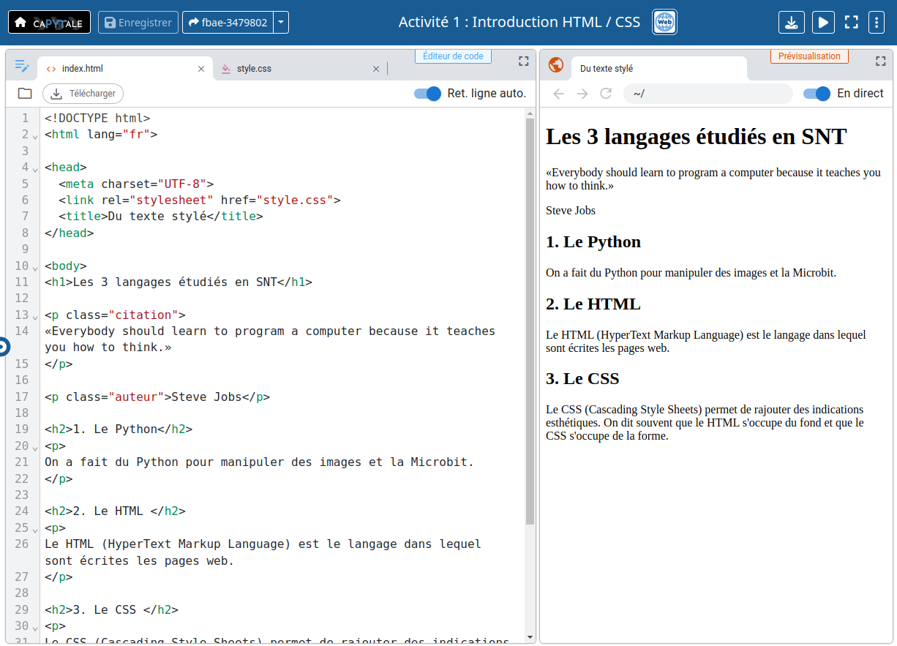

# Travail sur le HTML / CSS 

{{initexo(0)}}

Rendez-vous sur l'activité Capytale [https://capytale2.ac-paris.fr/web/c/fbae-3479802](https://capytale2.ac-paris.fr/web/c/fbae-3479802){. target="_blank"}


[{: .center}](https://capytale2.ac-paris.fr/web/c/fbae-3479802){. target="_blank"}


L'interface présente l'éditeur de fichiers à gauche (les fichiers ```index.html``` et ```style.css``` y sont ouverts) et l'aperçu de la page web sur la droite.

!!! example "{{ exercice() }} : travail sur les sections"
    
    

    **Q1.** Cliquer sur l'onglet `style.css` : ce fichier est pour l'instant vide.

    **Q2.** Le titre de niveau 1 dans la page est « Les 3 langages étudiés en SNT». Il est à l'intérieur de balises `<h1>`...`</h1>`. Nous allons donc écrire une règle de style qui modifie le style des balises `<h1>`. Dans le fichier `style.css`,  ajoutez le code suivant :
    ```python
    h1 {
    font-size: 32px;
    font-weight: normal;
    font-family: Georgia;
    color: blue;
    }
    ```


    **Q3.** En observant le résultat sur la prévisualisation, essayez de deviner ce que veut dire chaque ligne. N'hésitez pas à supprimer puis remettre les lignes une par une pour voir la différence entre quand elles sont là et quand elles ne sont pas là.

    {{
    correction(False,
    """
    ??? success \"Correction\" 
        ```python
        h1 { sert à démarrer une règle de style qui cible toutes les balises `<h1>`.
        font-size: 32px; sert à demander que le texte ait une taille de 32 pixels.
        font-weight: normal; sert à demander à ce que le texte ne soit pas en gras.
        font-family: Georgia; sert à demander à ce que la police de caractères soit Georgia. 
        color: blue; sert à modifier la couleur du texte.
        } sert à terminer la règle de style.
        ```
    """
    )
    }}


    **Q4.** Maintenant, à la suite de la règle précédente, sautez une ligne puis ajoutez une nouvelle règle pour que les titres de niveau 2 (balises `<h2>`...`</h2>`) aient :
    
    - une taille de police de 14 pixels,
    - une police de caractères Helvetica,
    - une police en gras (pour cela, `font-weight` doit avoir la valeur `bold`).

    {{
    correction(False,
    """
    ??? success \"Correction\" 
        ```python
        h2 {
        font-size: 14px;
        font-family: Helvetica;
        font-weight: bold;
        }
        ```
  
    """
    )
    }}


    **Q5.** Enfin, à la suite des deux règles précédentes, sautez une ligne puis ajoutez une nouvelle règle pour que les paragraphes (balises `<p>`...`</p>`) aient :

    - une taille de police de 20 pixels,
    - une police de caractères Arial.

    {{
    correction(False,
    """
    ??? success \"Correction\" 
        ```python
        p {
        font-size: 20px;
        font-family: Arial;
        }
        ```
  
    """
    )
    }}


Remarquez que les règles écrites précédemment s'appliquent à toutes les instances des balises ciblées. Par exemple, tous les paragraphes ont maintenant une taille de police de 20 pixels et une police de texte Arial. 

Que faire si on veut n'affecter que certaines balises d'un type donné mais pas toutes ?

On utilise pour cela l'attribut `class` des balises HTML.

!!! example "{{ exercice() }} : travail sur les classes"

    **Q1.** Dans le fichier `index.html`, q   uelle est la classe du premier paragraphe à la ligne 13 ?

    {{
    correction(False,
    """
    ??? success \"Correction\" 
        La classe est `citation`. En effet, la balise de paragraphe ouvrante a un attribut `class` avec la valeur `citation` : `<p class=\"citation\">`.
    """
    )
    }}
    

    **Q2.** Dans le fichier `style.css`, ajoutez la règle suivante (à la suite des autres règles) :
    ```python
    .citation {
    color: gray;
    font-style: italic;
    font-family: Helvetica;
    font-size: 22px;
    }    
    ```
    En observant le résultat sur la prévisualisation, essayez de deviner ce que veulent dire les deux premières lignes.

    {{
    correction(False,
    """
    ??? success \"Correction\" 
        ```python
        .citation { démarre une règle ciblant les balises ayant la classe citation. De manière générale, pour faire une règle qui cible une classe donnée, on met le nom de cette classe précédée d'un point.
        color: gray; met le texte en gris.
        font-style: italic; met le texte en italique.
        ```
    """
    )
    }}
   


    **Q3.** Ouvrir le fichier `index.html`. Remarquez qu'à la ligne 17, un autre paragraphe a une classe. Ajoutez une nouvelle règle au fichier `style.css` pour que ce paragraphe ait :

    - une taille de police de 16 pixels,
    - une police de caractères Arial.
    - une couleur de texte grise.

    {{
    correction(False,
    """
    ??? success \"Correction\" 
        ```python
        .auteur {
        color: gray;
        font-family: arial;
        font-size: 16px;
        }
        ``` 
    """
    )
    }}


??? quote "source"
    Travail intialement basé sur l'activité Capytale de Maverick Chardet
