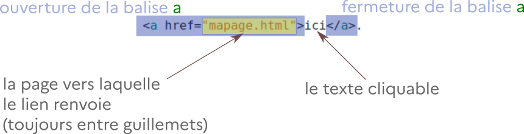
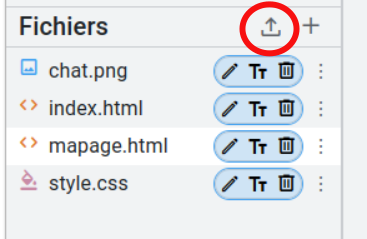

# Travail sur les liens et les images

{{initexo(0)}}

Rendez-vous sur l'activité Capytale [https://capytale2.ac-paris.fr/web/c/6663-3483254](https://capytale2.ac-paris.fr/web/c/6663-3483254){. target="_blank"}


!!! example "{{ exercice() }} : Lien hypertexte"
    
    **Q1.** Dans le fichier ```index.html```, insérer au sein du ```body``` le texte suivant :
    ```
    Si vous voulez voir ma page perso, c'est <a href="mapage.html">ici</a>.
    ``` 
    
    et observer le rendu sur la page.

    La structure d'un lien hypertexte est donc basée sur une balise ```a```, dont l'ouverture contient une variable ```href``` qui est égale à la page sur laquelle on veut renvoyer l'utilisateur :

    {: .center}
    

    **Q2.** Dans le fichier ```mapage.html```, insérer un lien pour renvoyer vers la page ```index.html```

    {{
    correction(False,
    """
    ??? success \"Correction\" 
        ```
        Retour à la <a href=\"index.html\">page d'accueil</a>.
        ```
    """
    )
    }}  


!!! example "{{ exercice() }} : insérer une image"
    
    **Q1.** Dans le fichier ```mapage.html```, insérer le code ci-dessous :
    ```
    ah si, une photo de chat :

    
    ``` 

    La structure est donc une mono-balise ```img```, qui contient une variable ```src``` (pour *source*) qui égale au nom du fichier image.

    On peut y rajouter d'autres variables :

    - ```width```, pour contrôler la taille de l'image
    - ```alt```, qui contiendra une description de l'image. C'est très important pour permettre aux déficients visuels de pouvoir naviguer sur internet !   

    Exemple :
    ```
    
    ```
    
    Cette image a pu être insérée car elle était déjà présente parmi nos fichiers disponibles. 

    **Q2.** Choisir une image sur internet, la télécharger puis la téléverser dans Capytale à l'aide de ce bouton {: .center}
    

    **Q3.** Dans la page ```index.html```, insérer votre image **en la rendant cliquable** : elle doit vous envoyer sur la page ```mapage.html```.

    {{
    correction(False,
    """
    ??? success \"Correction\" 
        ```
        <a href=\"mapage.html\">
        
        </a>
        
        ```
    """
    )
    }}


