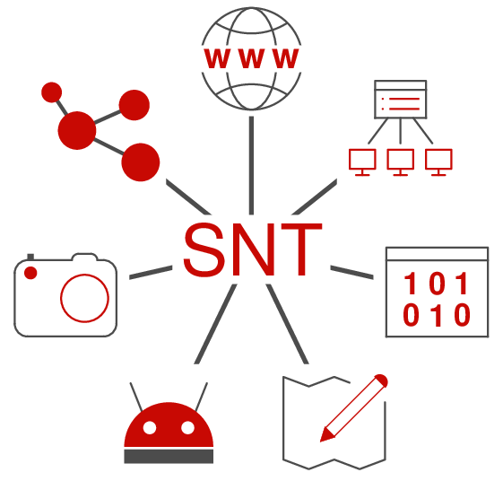
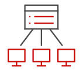
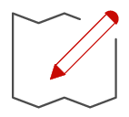

{#
!!! abstract ":star: Première séance :star:"
    :white_check_mark: Vérification des accès aux [services numériques](Introduction/services_num/index.md)

    :white_check_mark: Inscription à la plateforme [Moodle](Introduction/moodle/moodle/)

    :hourglass: Pour patienter : découverte de Python avec [py-rates](https://py-rates.fr/){. target="_blank"}
#}

:arrow_right: pour les :star: **201** :star: : [Projet EMC-SNT](./IA-EMC/cours.md){. target="_blank"} sur l'IA.

!!! abstract ":star: Séance actuelle :star:"
    - [Carte Microbit](./Theme4_Objets_Connectes/cours.md){. target="_blank"}
    - [Réseaux sociaux : Exposés](./Theme3_Reseaux_Sociaux/Activité1_Exposés.md){. target="_blank"}
    - [Localisation-Cartographie : cours et activités](./Theme2_Localisation_Cartographie/cours/){. target="_blank"}

{#
- :star: Séances actuelles :star: : 
    - [https://compute-it.toxicode.fr/](https://compute-it.toxicode.fr/){. target="_blank"}
    - [Enigmes d'OSINT](https://www.adventofosint.com/fr/2023/){. target="_blank"}
    - [Python avec py-rates](https://py-rates.fr/){. target="_blank"}
    - [Activité sur les réseaux sociaux](./Theme3_Reseaux_Sociaux/Activité2_Graphes_amis.md){. target="_blank"}
        
#}

{#

??? note "*Anciens thèmes traités*"
    - [Localisation-Cartographie : cours et activités](./Theme2_Localisation_Cartographie/cours/){. target="_blank"}
    - [Calendrier de l'Avent OSINT](https://www.osint4fun.eu/fr/){. target="_blank"}
    - [Évaluation Photographie numérique sur LycéeConnecté / Moodle](https://jeunes.nouvelle-aquitaine.fr/formation/au-lycee/lycee-connecte-ent){. target="_blank"}
    - [Activité d'incrustation d'image en Python](./Theme1_Photographie_numerique/incrustation_image/) 
    - [cours Photographie numérique](./Theme1_Photographie_numerique/cours/) 
    - [Découverte du binaire](./Introduction/binaire/binaire)

#}
<!--  --
snt/docs/Introduction/binaire/binaire.md  
??? note "*Anciens thèmes traités*"
    - Exposés : [Activité 1](./Theme3_Reseaux_Sociaux/Activité1_Exposés/){. target = "_blank"}
    - Le rachat d'Instagram par Facebook : [Activité 4](./Theme3_Reseaux_Sociaux/Activité4_Facebook-Instagram/){. target = "_blank"}
    - Le cyber-harcèlement : [Activité 3](./Theme3_Reseaux_Sociaux/Activité3_cyberharcèlement/){. target = "_blank"}
    - Graphe des amis : [Activité 2](./Theme3_Reseaux_Sociaux/Activité2_Graphes_amis/){. target = "_blank"}
    - en module : Python par le jeu : [PyRates](https://py-rates.fr/){. target = "_blank"}
    - en module : [PIX](./TT_PIX/cours/)
    - en module : [Itinéraires](./Theme2_Localisation_Cartographie/Activité4_Itineraires/) 
    - en module : [GéoPortail](./Theme2_Localisation_Cartographie/Activité3_GeoPortail/)  
    - en classe entière : [Localisation et cartographie](./Theme2_Localisation_Cartographie/cours/)  
    - en module : [Métadonnées EXIF](./Theme2_Localisation_Cartographie/Activité2_Exif/)  
    - en module : [Se repérer à la surface de la Terre](./Theme2_Localisation_Cartographie/Activité1_GPS/)  
    - en module : [Incrustation d'une image en Python](./Theme1_Photographie_numerique/z_incrustation_image/)  
    - en classe entière : [Photographie numérique](./Theme1_Photographie_numerique/cours/)    

- [207 GA](https://capytale2.ac-paris.fr/web/c-auth/list?returnto=/web/code/01c9-200908)
- [207 GB](https://capytale2.ac-paris.fr/web/c-auth/list?returnto=/web/code/f727-201289)

- [215 GA](https://capytale2.ac-paris.fr/web/c-auth/list?returnto=/web/code/5233-201287)
- [215 GB](https://capytale2.ac-paris.fr/web/c-auth/list?returnto=/web/code/49a9-201288)

-->

{: .center width=30%}

## Programme 

!!! abstract "Le [programme](https://eduscol.education.fr/1670/programmes-et-ressources-en-sciences-numeriques-et-technologie-voie-gt) de SNT est articulé autour de sept thèmes:"

    === "Données structurées"
        {align=left}
        
        Les données constituent la matière première de toute activité numérique. Afin de permettre leur réutilisation, il est nécessaire de les conserver de manière persistante. Les structurer correctement garantit que l’on puisse les exploiter facilement pour produire de l’information.

        Comment traiter ces données ?
    === "Photo numérique"

        {align=left}
        
        Les technologies de la photographie argentique ont eu une évolution très lente, liée aux progrès en optique, mécanique et chimie. Ce n’est plus du tout le cas de l’évolution actuelle, davantage due aux algorithmes qu’à la physique : algorithmes de développement et d’amélioration de l’image brute, algorithmes d’aide à la prise de vue. La photographie numérique présente un coût marginal très faible et une diffusion par internet facile et immédiate : chaque jour, des milliards de photos sont prises et partagées.

        Comment sont représentées ces images sur un ordinateur et comment les traiter pour les modifier?

    === "Internet"
        {align=left}

        Grâce à sa souplesse et à son universalité, Internet est devenu le moyen de communication principal entre les hommes et avec les machines.

        Quels sont les techniques et protocoles qui permettent la circulation des informations sur ce réseau mondial?
    === "Web"
        {align=left}

        Le Web (toile) désigne un système donnant accès à un ensemble de données (page, image, son, vidéo) reliées par des liens hypertextes et accessibles sur le réseau Internet.

        Comment sont construites les pages Web et comment communiquer avec un serveur?

    === "Réseaux sociaux"
        {align=left}

        Les réseaux sociaux sont des applications basées sur les technologies du Web qui offrent un service de mise en relation d’internautes pour ainsi développer des communautés d’intérêts.

        Comment ces réseaux gèrent les données des utilisateurs et comment mettent-ils en place les services de recommandation/suggestion?
    === "Localisation /cartographie"
        {align=left}

        La cartographie est essentielle pour beaucoup d’activités : agriculture, urbanisme, transports, loisirs, etc. Elle a été révolutionnée par l’arrivée des cartes numériques accessibles depuis les ordinateurs, tablettes et téléphones, bien plus souples à l’usage que les cartes papier.

        Comment se repérer sur ces cartes et comment calculer un itinéraire?

    === "Objets connectés"
        {align=left}
        Embarquer l’informatique dans les objets a beaucoup d’avantages : simplifier leur fonctionnement, leur donner plus de possibilités d’usage et de sûreté, et leur permettre d’intégrer de nouvelles possibilités à matériel constant par simple modification de leur logiciel.

        Comment réaliser un programme simple à embarquer dans un objet?

Nous y rajouterons un thème transversal : «Débuter en Python».

